# 1.Cách khai thác BOF rõ hơn, khác với trên máy tính ?

## 1.1. Đặc trưng của khai thác BOF trên firmware

Do trên các thiết bị IOT, có đường vào khác so với các thiết bị software nên cách khai thác cũng khác, chủ yếu qua các con đường :

+ Remote qua mạng : gửi các input đúng định dạng để đi vào code lỗi

+ File-based : không gửi input qua mạng(HTTP/TCP/UDP) mà đưa hẳn 1 file vào thiết bị, firmware sẽ đọc và đồng nhất.

+ Local/physical : Nối dây trực tiếp với thiết bị, USB.

_Remote qua mạng:_

Đa số các thiết bị iot đều có các web admin chạy trên thiết bị để giúp quản trị thiết bị. Bên trong firmware sẽ có :

+ Web server
+ Trang HTML/JS
+ Các handler nhận yêu cầu và gọi C/C++ để xử lí cấu hình

_File-based:_ 

Tải lên một file độc hại. Khi firmware hoặc ứng dụng trên thiết bị mở và xử lí file thì xảy ra lỗi Buffer Overflow. Firmware đọc file từ hệ thống tệp hoặc giao thức USB nếu cho phép gắn file qua USB hoặc tải tệp qua giao thức mạng

_Local-Physical:_ 

Truy cập trực tiếp vào thiết bị qua các kết nối vật lý, các điểm truy cập vật lí. Sửa đổi được firmware từ bên trong nếu có quyền truy cập vào cổng USB, thẻ SD để tạo ra lỗi mà không cần kết nối qua mạng

## 1.2. Khác biệt so với khai thác trên máy tính

__Môi trường:__

+ Firmware IOT thường có hệ điều hành đơn giản, không bảo mật tốt, tài nguyên hạn chế nên dễ nhận ra các lỗi Buffer Overflow nhưng cũng giới hạn khả năng khai thác do không thể tạo các payload phức tạp
+ Phần mềm máy tính : Hệ điều hành đầy đủ như Windows, Linux có đầy đủ tính năng bảo mật. Bộ nhớ lớn khiến các kỹ thuật tấn công Buffer Overflow phải khỏe.

__Quản lý quyền truy cập:__ 

+ Thiết bị IOT : thường không phân quyền, không có cơ chế bảo mật nên dễ qua tường lửa hay các biện pháp bảo mật
+ Phần mềm máy tính : Phân quyền rõ ràng, tấn công khó khăn với các biện pháp bảo mật được thiết lập

__Phương thức khai thác:__

+ IOT : Thường dùng các giao thức mạng như Telnet, SSH hoặc HTTP  nên có thể bị gửi 1 input không kiểm tra qua giao thức này gây buffer overflow. Có thể lợi dụng tệp cấu hình firmware nếu có sẵn để phân tích và tấn công. Hoặc kết nối thẳng qua cổng vật lý thì có thể trực tiếp giao tiếp với bộ nhớ và hệ điều hành luôn
+ Phần mềm máy tính : Buffer Overflow hay xuất hiện ở những chỗ nhập dữ liệu, xử lý văn bản, các giao thức mạng như FTP, HTTP, SMTP.

# 2.Tại sao iot không dùng x86-64 mà dùng kiến trúc khác, khác biệt là gì ?

Một số nguyên nhân IOT không dùng x86-64 mà dùng ARM, MIPS :

+ Tiết kiệm năng lượng : ARM, MIPS, RISC tiêu thụ năng lượng thấp để các thiết bị IOT hoạt động trong thời gian dài liên tục. Còn x86-64 phục vụ các máy tính, yêu cầu tính toán cao nên tiêu thụ điện nhiều.

+ Kích thước, chi phí : ARM, MIPS, RISC sản xuất đơn giản, thiết kế đơn giản, điều chỉnh linh hoạt, hiệu năng thấp nên phù hợp với các yêu cầu của IOT. Còn x86-64 lớn, tiên tiến, các lệnh tính toán phức tạp, đa nhiệm nên kích thước phải lớn không phù hợp với các thiết bị IOT nhỏ gọn.

+ Hỗ trợ phần mềm và hệ điều hành : kiến trúc ARM có hệ sinh thái phần mềm phong phú, các hệ điều hành hỗ trợ mạnh mẽ cho IOT.Còn x86-64 thì có Windows và Linux nhưng hệ điều hành này có kích thước lớn, yêu cầu phần cứng mạnh mẽ.

+ Hiệu suất : ARM, MIPS có hiệu suất đủ tốt cho các tác vụ IOT, xử lí các tác vụ đơn giản như thu thập dữ liệu qua cảm biến hoặc mạng. x86-64 thì có hiệu suất xử lí vượt trội, tính toán đa nhiệm phức tạp, không cần thiết cho hầu hết IOT. Vì IOT chỉ cần 1 chút tín hiệu đơn giản để thu thập và truyền tải dữ liệu thay vì xử lí các tính toán nặng nề như máy tính hay máy chủ.

-> Điểm khác biệt là do thiết kế của x86-64 phức tạp, khả năng tính toán đa nhiệm, bộ nhớ tốt, đa luồng, được thiết kế để tối ưu hóa các ứng dụng tính toán nặng.

# 3.Phân tích 1 file bin xem có đường dẫn hay mật khẩu gì ?

Nguồn file trong bài này : https://pronetsolutionsvn.com/wp-content/uploads/2024/04/vnpt_F671Y_VP9.0.11P2N32.zip

## 3.1. Khai thác ban đầu

Đầu tiên tải file về và giải nén file ra có 1 tệp bin

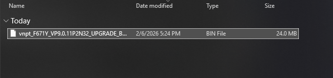

Kiểm tra xem đây là file gì thì chỉ được biết là file có thể chứa 1 khóa công khai OpenPGP

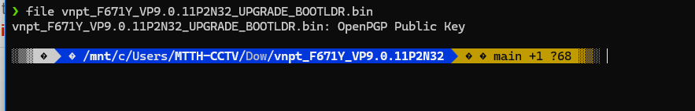

Sử dụng binwalk để phân tích file 

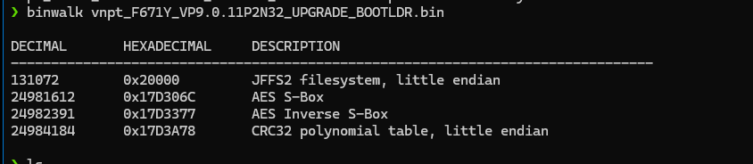

Nhận thấy đây là 1 file chứa các thành phần như hệ thống tệp JFFS2, AES S-Box và CRC32

+ JFFS2 filesystem, little endian : hệ thống tệp dùng trong các router, chứa dữ liệu cấu hình, thông tin người dùng, mật khẩu(được mã hóa)

+ AES S-Box : Thành phần mã hóa

+ AES Inverse S-Box : Thành phần giải mã

+ CRC32 Polynomial Table :  thuật toán kiểm tra tính toàn vẹn của giữ liệu

-> Như vậy cần trích xuất dữ liệu từ hệ thống tệp JFFS2

## 3.2. Khai thác JFFS2

Trích xuất các tệp trong hệ thống JFFS2 : 

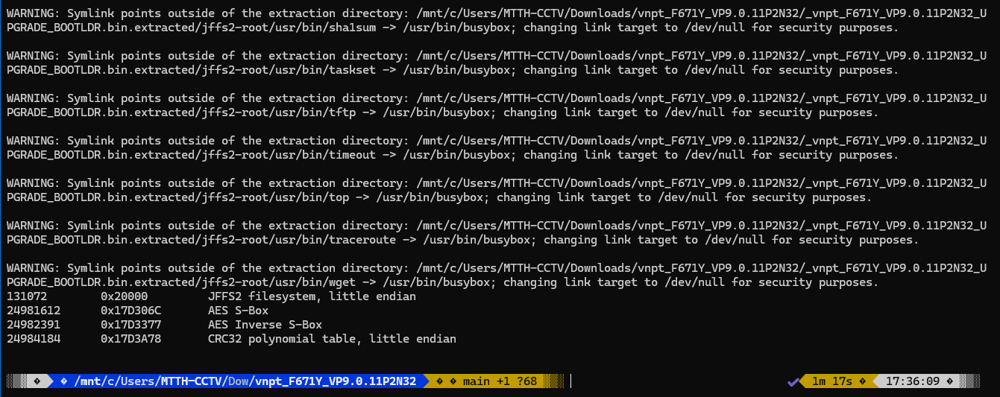

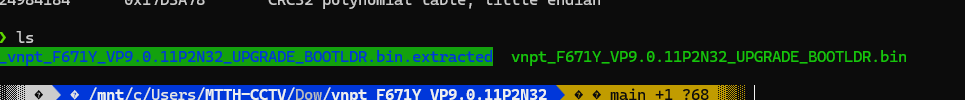

Có một tệp được extract, kiểm tra :

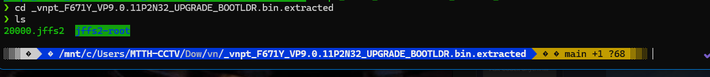

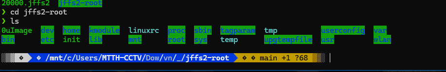

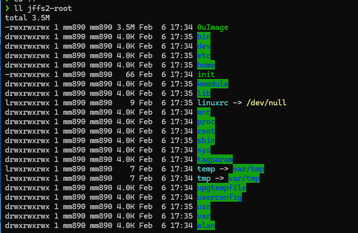

Vào trong tệp etc : 

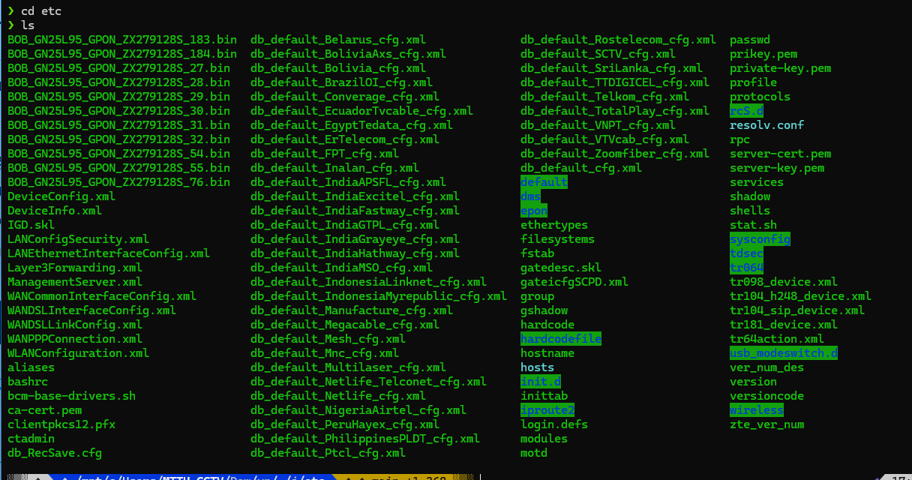

Có một số tệp đáng chú ý như:

+ Tệp mật khẩu : passwd, shadow chứa thông tin người dùng và mật khẩu

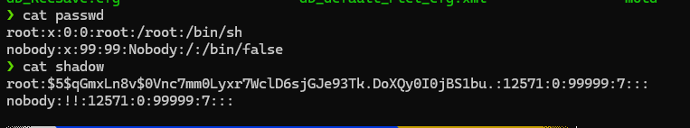

+ Tệp bảo mật : server-cert.pem, server-key.pem chứa các tệp chứng chỉ cho việc bảo mật ssl/tls, private-key.pem là khóa riêng cho việc mã hóa và giải mã dữ liệu

+ Tệp cấu hình hệ thống : sysconfig cấu hình hệ thống, interfaces, ethertype, hostname cấu hình mạng

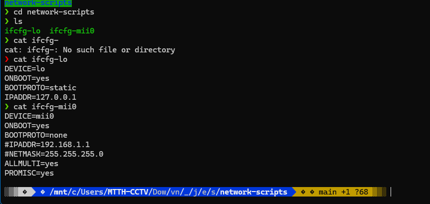

+ Quản lý hệ thống : rcS.d và

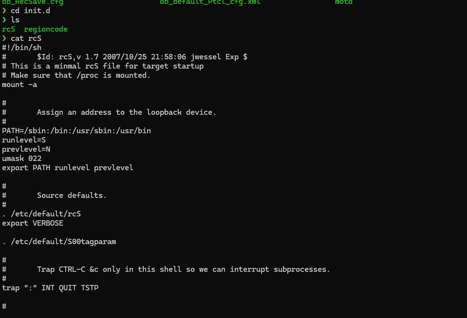

Có thể nhận ra một số thứ như mật khẩu đã được mã hóa, nhưng không thể crack bằng crackstation

Tìm kiếm theo một số chuỗi để khai thác các thông tin về tài khoản và mật khẩu người dùng 

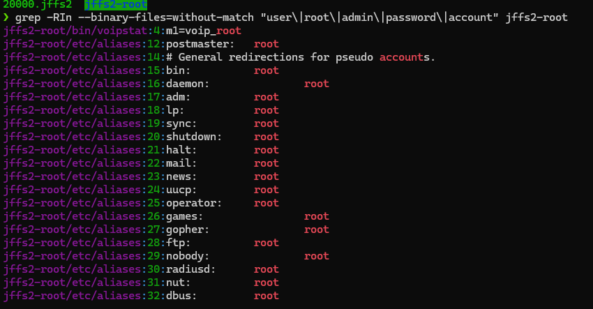

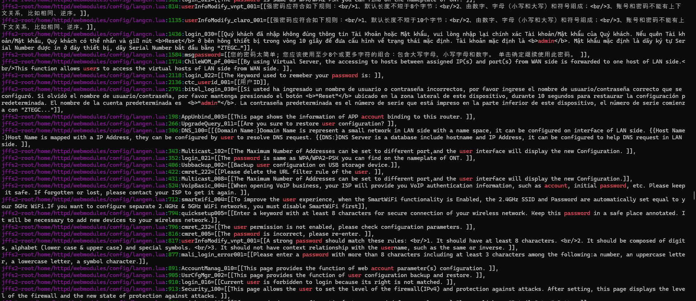

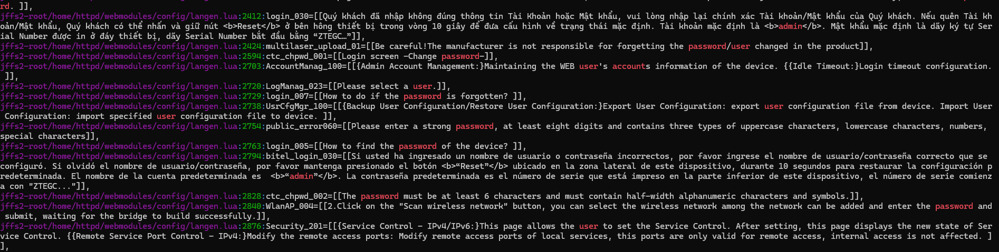

Các dịch vụ đang chạy

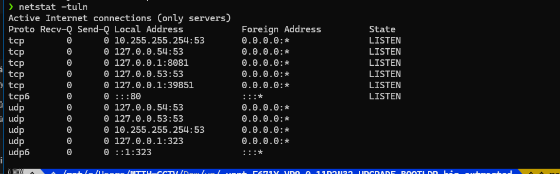

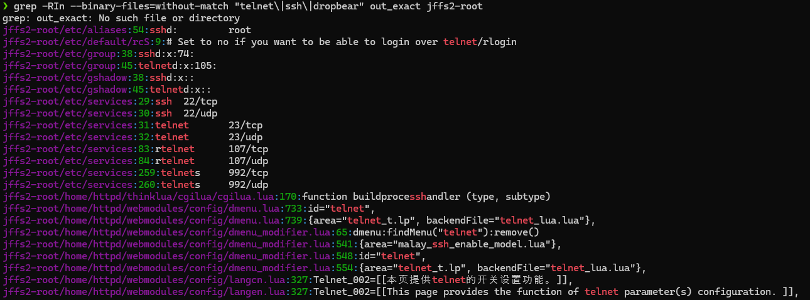

## 3.3. Phân tích bằng IDA

Thử phân tích tĩnh bằng IDA:

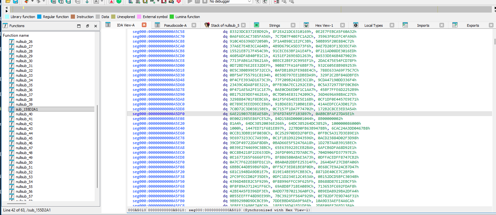

Strings :

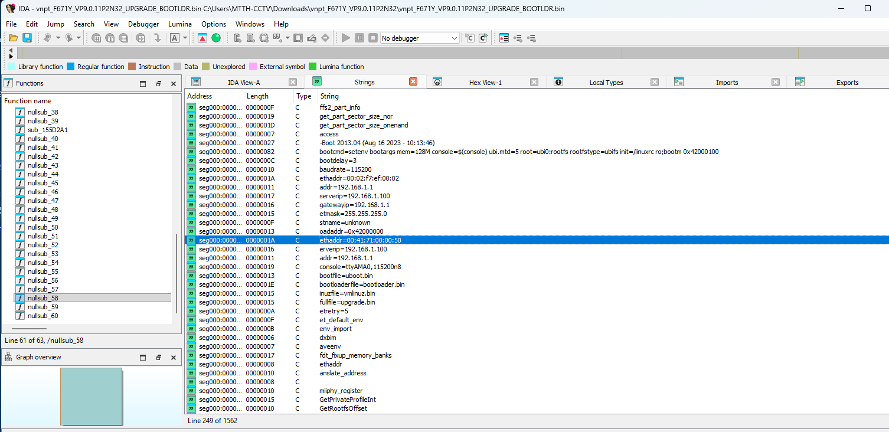

Có thể nhận thấy là nó đang tải cái gì đó vào bộ nhớ, có thể lợi dụng đây là nguồn vào để khai thác các lỗ hổng

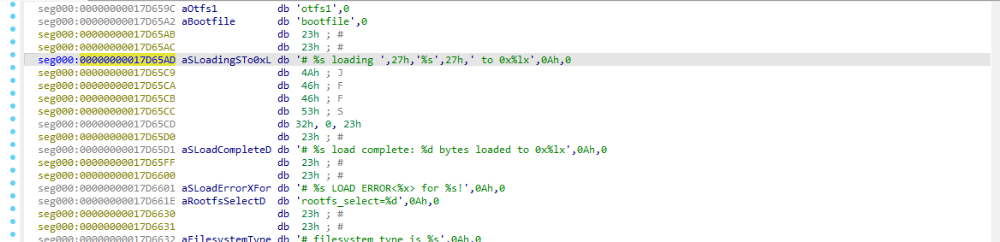

Như vậy có thể thấy là file đã mã hóa, không có mã giả nên khó trong việc phân tích tĩnh bằng IDA