# Mở đầu

Có 2 hướng nghiên cứu dựa trên 2 bài viết:

+ Hướng đầu tiên là RE ra mã giả rồi cho LLM phân tích - https://www.preprints.org/manuscript/202510.0166
  
+ Hướng thứ 2 là dùng plugin để biến binary thành dạng có thể dùng viết lệnh truy vấn tìm lỗ hổng - https://zetier.com/codeql-for-binaries/

Mục tiêu là test xem 2 hướng trên có ổn không thì sẽ xử lý tiếp.

Nhiệm vụ của lần này là test xem hướng thứ 2 có khả thi không.

Thử nghiệm bằng cách download 1 file image -> extract bằng binwalk -> tạo đồ thị bằng ghidra2cpg -> Truy vấn lệnh bằng joern -> Khai thác lỗ hổng

# Tiến hành

## Giải nén file

Giải nén file bằng binwalk

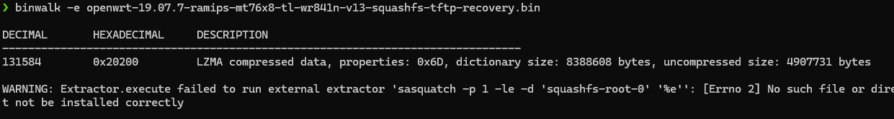

Sau khi giải nén file thì ta có các file sau :

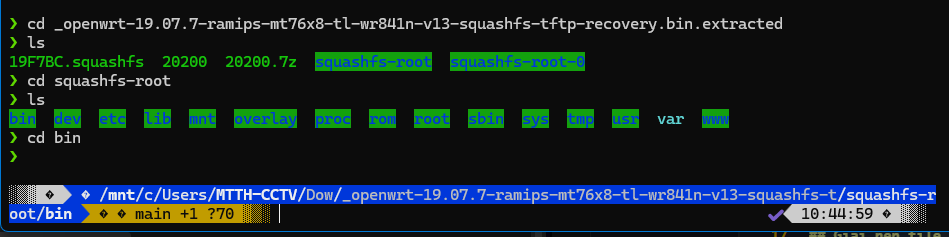

## Tạo đồ thị

Vào /squashfs-root/ , tìm các ELF trong đây

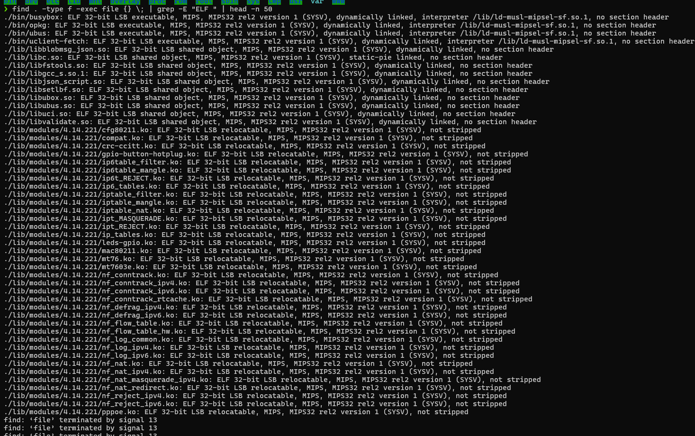

Một số ELF đáng chú ý có thể ưu tiên là :
+ web : httpd, uhttpd, boa, lighttpd, cgi
+ rpc/ubus: rpcd, ubusd
+ network services: dropbear, telnetd, dnsmasq, pppd

Ta sẽ tạo đồ thị cho ELF của rpcd và uhttpd. Bởi vì đây là những binary quan trọng, với uhttpd thì là web server còn rpcd thì là chỗ để thực thi các lệnh hệ thống. Và quan trọng là nó nhận input từ mạng

Ta xây đồ thị bằng ghidra2cpg. Ghidra2cpg sẽ map các sections để tạo memory và instruction. Ghidra chuyển các bytecode thành lệnh. Sau đó Decomplier sẽ chuyển Assembly thành mã giả C. Từ đó ghidra2cpg lấy các thông tin và dựng AST graph, CFG graph, CALL graph, DATA flow. Và gộp tất cả vào 1 graph duy nhất. Đóng gói thành file _.zip_

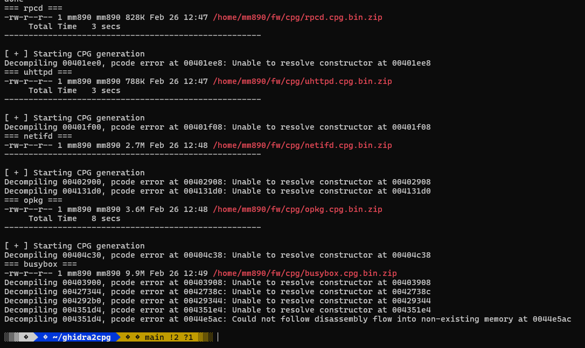

## Truy vấn

### Truy vấn file rpcd

Mở joern và tải file vào để truy vấn.

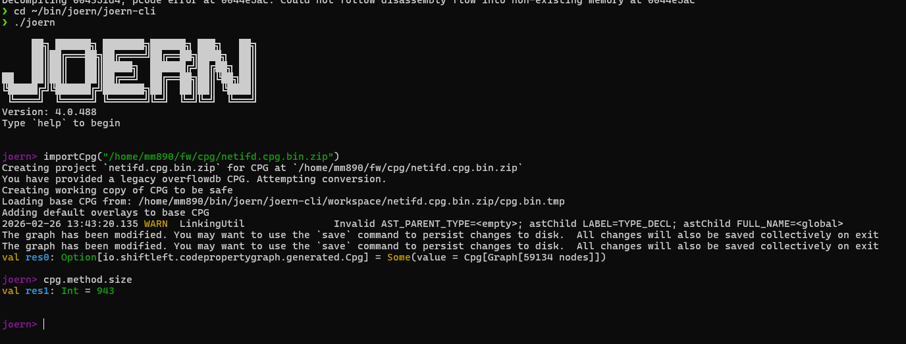

Với file rpcd thì sẽ có một số hàm đặc trưng của file này ta có thể khai thác. 

###  System()

```
cpg.call.nameExact("system").l
```

Liệt kê tất cả các lời gọi system

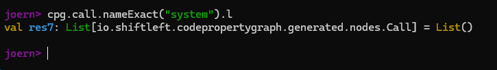

Nếu mà có hàm thì xem nó trong hàm nào.

```
cpg.call.nameExact("system")
  .map(c => (c.method.fullName, c.code))
  .l
```

Như kết quả bên trên là không có lời gọi nào.

### Execl, Execv, execve

```
cpg.call.name("execl|execv|execve").l
```

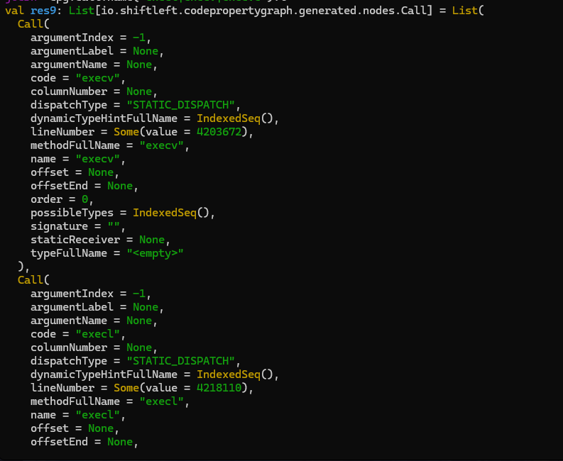

Xem cụ thể các tham số

```
cpg.call.name("execl|execv|execve")
  .map(c => (c.method.fullName, c.argument.code.l))
  .l
```

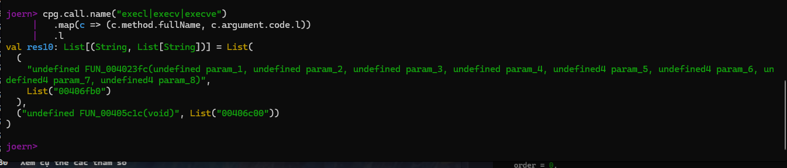

Kết quả trên là cơ bản có 2 hàm gọi exec là FUN_004023fc và FUN_00405c1c

Tiếp theo là cần xem các hằng số trong hàm

```
cpg.literal.code("00406cb0").l
     | cpg.literal.code("00406c00").l
```

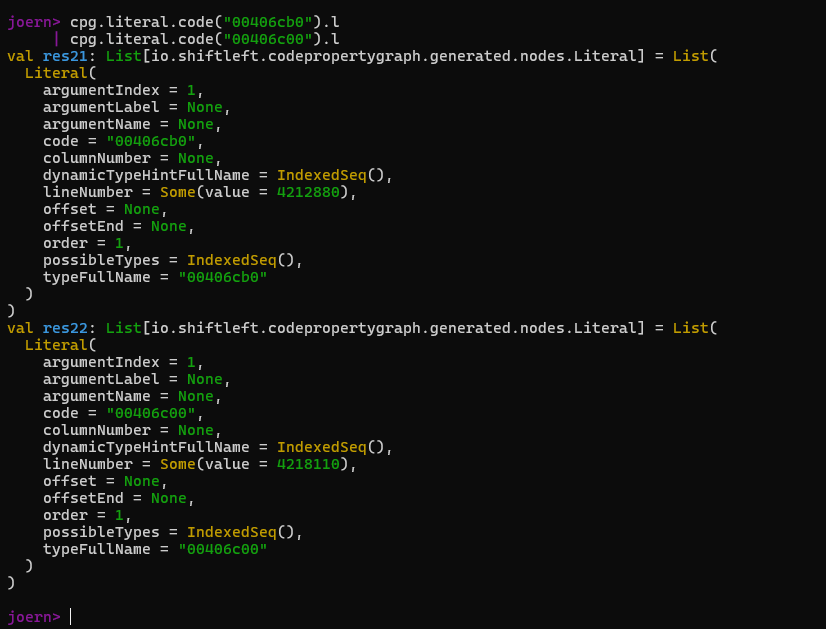

Từ kết quả thì chỉ nhận diện ra được dạng kiểu đây là 1 hằng số địa chỉ thôi dạng như execl(0x0000111)

Mục tiêu của ta là muốn tìm 1 số hằng số mà được exec kiểu như "/bin/sh", "/sbin/reboot/", "content-type" Nên là có vẻ hằng số như kia thì nó trỏ tới một hàm gì đó.

### Tìm Buffer Overflow

#### Các hàm nguy hiểm

```
cpg.call.name("strcpy|strcat|gets|sprintf").l
```

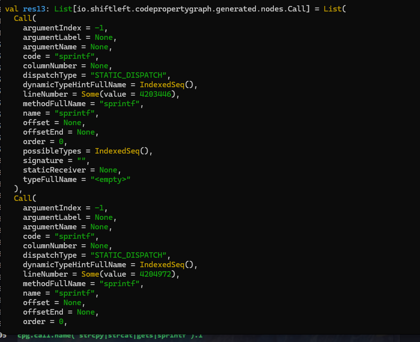

#### Memcpy

```
cpg.call.nameExact("memcpy").l
```

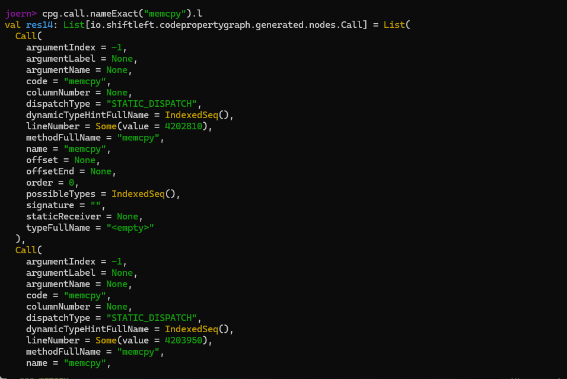

Xem toàn bộ đối số truyền vào 

```
cpg.call.nameExact("memcpy")
  .map(c => (c.method.fullName, c.lineNumber, c.argument.code.l))
  .l
```

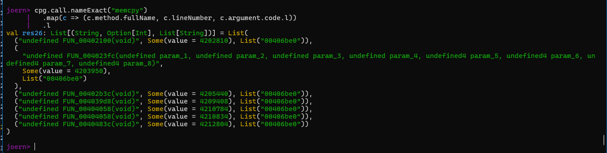

#### Kiểm tra kích thước buffer

```
cpg.call.nameExact("memcpy")
  .map(c => (c.method.fullName, c.argument.code.l))
  .l
```

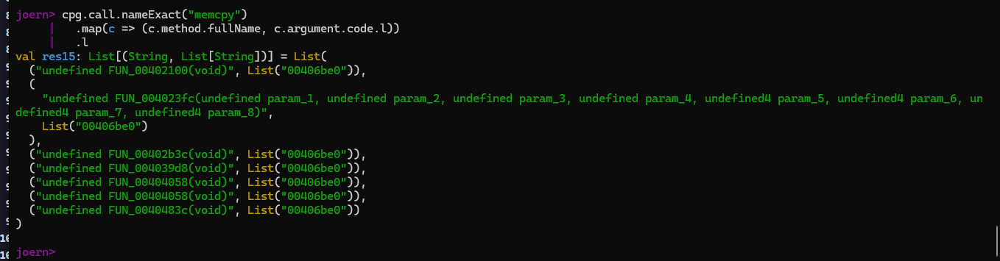

### Truy vấn file uhttpd

#### Xác định các điểm vào

Mục tiêu là xác định nơi đọc dữ liệu

```
cpg.call.name("accept|recv|read")
  .map(c => (c.name, c.lineNumber, c.method.fullName))
  .l
  .distinct
  .sortBy(_._2.getOrElse(0))
```

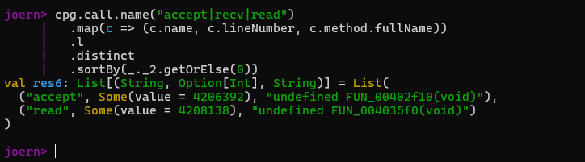

Ta sẽ xem các lời gọi nhạy cảm trước

```
cpg.call.name("recv|read|accept|fork|exec.*|system|open|stat|realpath").l
```

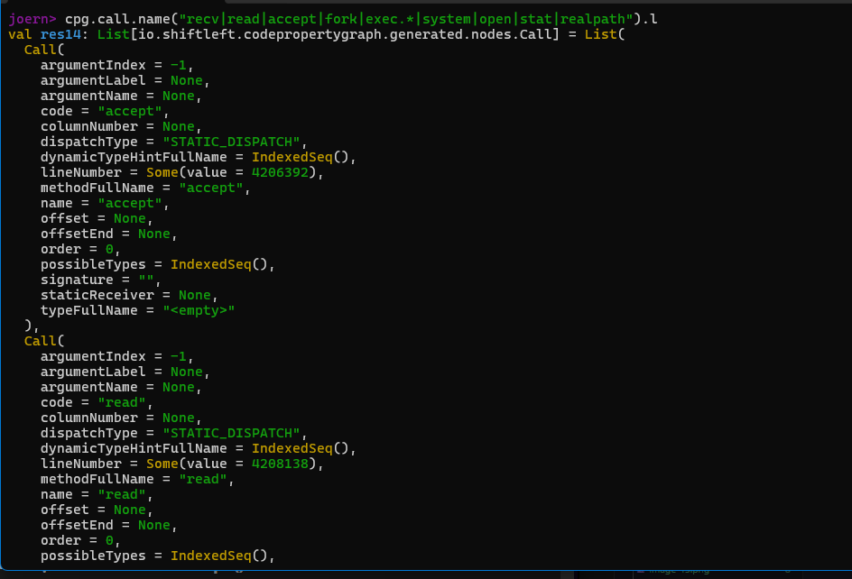

Xác định method gọi accept

```
cpg.call.nameExact("accept").method.fullName.l.distinct
```

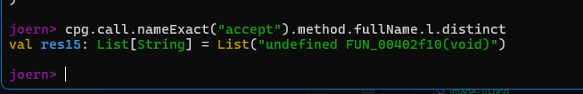

-> method FUN_0402f10 gọi

Theo luồng FUN_0402f10, ta liệt kê toàn bộ lệnh trong hàm

```
cpg.method.name("FUN_00402f10").ast.code.l.take(400)
```

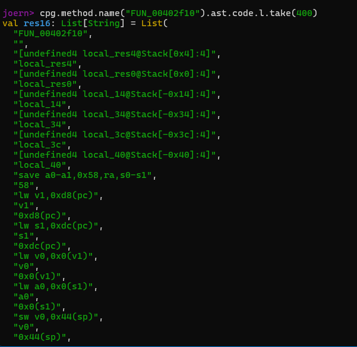

Nó ra một loạt các lệnh dạng như asm, khả năng phải phân tích thủ công logic

Ta liệt kê các node CFG

```
cpg.method.name("FUN_00402f10").cfgNode.code.l.take(200)
```

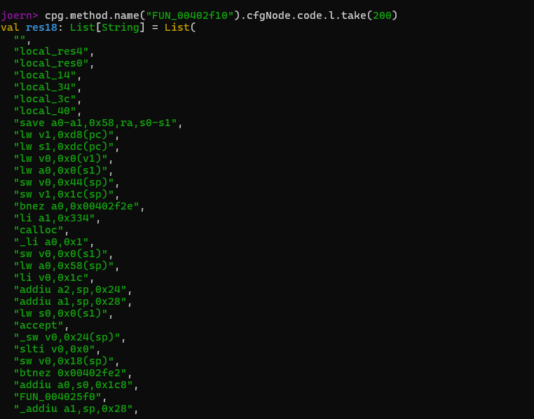

Xác định được nhánh. Thử khai thác nhánh một số nhánh quan trọng

Giải thích: qua kết quả trên, ta lấy cạnh của cái node. Nhưng mà ở đây ta hiểu là node này sẽ nhảy đến node khác qua 1 điều kiện nào đó. Nếu đúng thì nhảy đến node kế tiếp, sai thì sẽ vẫn tiếp tục lệnh tiếp theo trong node. 

Đi sâu hơn tiếp bằng 1 truy vấn thì xác định được rằng, node đã bị mất 1 nhánh như trên dẫn tới không thể phân tích tiếp.

Mặc dù thế ta vẫn có thể kết luận rằng con đường vừa phân tích rằng hàm FUN_00402f10 tiếp nhận và khởi tạo kết nối mới tỏng uttpd, sau khi gọi accept(), nó khởi tạo connection, nhưng không xử lý trực tiếp dữ liệu HTTP. Các truy vấn của Joern giúp ta xác định được các lời gọi hệ thống và dựng lại hệ thống xử lý connection.

Nhưng do hạn chế của đồ thị nên một số nhánh điều khiển không được thể hiện đủ vì vậy rất khó phân tích.
