Định hướng : Ghidra -> Pseud C -> c2cpg -> graph -> joern -> query

# Tìm mục tiêu khai thác 

## Tìm theo các sink call

```
val sinks = List("strcpy","strcat","sprintf","snprintf","vsprintf","system","popen","dlopen","open","fopen","execve")
cpg.method
  .map(m => (m.name, m.call.nameExact(sinks:_*).size))
  .l
  .sortBy(_._2)(Ordering[Int].reverse)
  .take(40)
```

Từ trên ta sẽ có danh sách các Hàm mà có sử dùng các hàm con trên cùng số lượng mà nó sử dụng

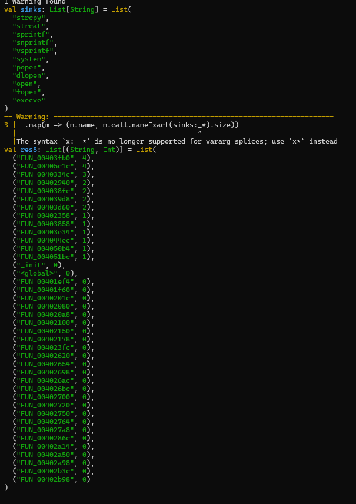

Như vậy có thể thấy là cái hàm FUN_00403fb0 là sử dụng nhiều nhất, ta mổ xẻ nó đầu tiên.

## Chọn mục tiêu và khai thác

### In pseudo code

```
println(cpg.method.nameExact("FUN_00403fb0").head.code)
```

Ta có code sau:

```c
void FUN_00403fb0(undefined4 param_1,undefined4 param_2,undefined4 param_3)

{
  undefined *puVar1;
  FILE *__stream;
  FILE *__s;
  size_t __n;
  int iVar2;
  char acStack_114 [256];
  int local_14;

  local_14 = *(int *)PTR___stack_chk_guard_00404048;
  snprintf(acStack_114,0x100,PTR_DAT_0040404c,param_1,param_3);
  __stream = fopen(acStack_114,PTR_DAT_00404050);
  snprintf(acStack_114,0x100,PTR_DAT_0040404c,param_2,param_3);
  __s = fopen(acStack_114,PTR_DAT_00404054);
  puVar1 = PTR___stack_chk_guard_00404048;
  if (__stream != (FILE *)0x0) {
    if (__s != (FILE *)0x0) {
      while (iVar2 = feof(__stream), iVar2 == 0) {
        __n = fread(acStack_114,1,0x100,__stream);
        if (0 < (int)__n) {
          fwrite(acStack_114,1,__n,__s);
        }
      }
    }
    fclose(__stream);
  }
  if (__s != (FILE *)0x0) {
    fclose(__s);
  }
  if (local_14 == *(int *)puVar1) {
    return;
  }
                    /* WARNING: Subroutine does not return */
  __stack_chk_fail();
}
```

### Xem hàm gọi sink nào

```
val m = cpg.method.nameExact("FUN_00403fb0").head
m.call.nameExact(sinks*).l.map(c => (c.name, c.code, c.lineNumber))
```

Ta có kết quả sau:

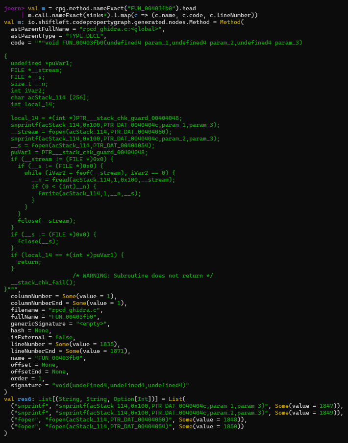

### Kiểm tra xem có stack buffer không

```
m.ast.code(".*acStack_.*").l.distinct
```

Ta có kết quả sau:

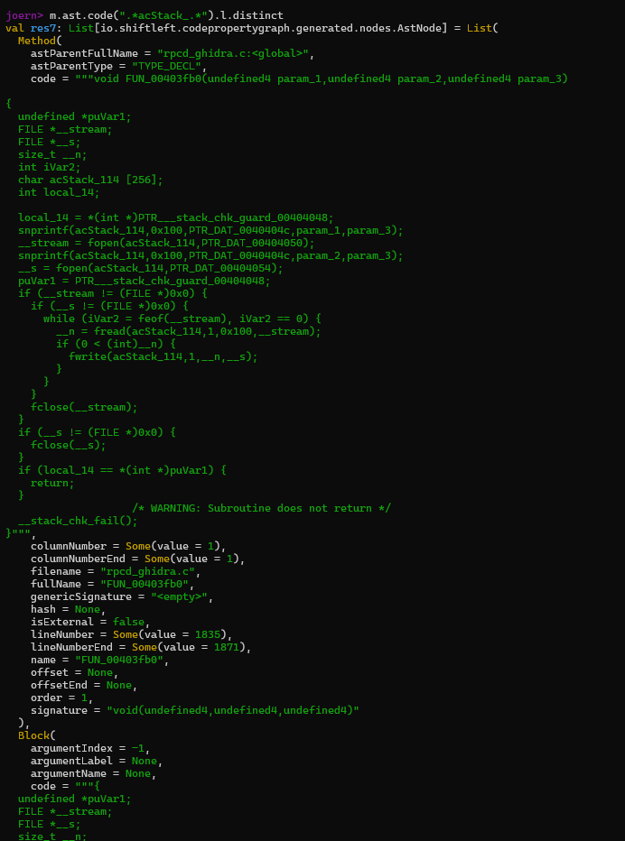

Kết quả khá dài

### Xem ai gọi hàm này

```
cpg.method.nameExact("FUN_00403fb0").callIn.method.name.l.distinct
```

Có kết quả:

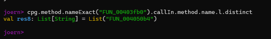

### Phân tích

Từ kết quả trên có thể dịch nôm na đoạn code ra như này :

```C
void FUN_00403fb0(p1, p2, p3) {
  char buf[256];

  snprintf(buf, 0x100, FMT, p1, p3);
  in = fopen(buf, MODE_IN);

  snprintf(buf, 0x100, FMT, p2, p3);
  out = fopen(buf, MODE_OUT);

  if (in && out) {
    while (!feof(in)) {
      n = fread(buf, 1, 0x100, in);
      if (n > 0) fwrite(buf, 1, n, out);
    }
  }
  fclose(in);
  fclose(out);
}
```

Có thể hiểu là đoạn code giúp copy nội dung từ file này sang file kia với:
+ Đường dẫn file A : snprintf(buf, 0x100, FMT, p1, p3);
+ Đường dẫn file B :  snprintf(buf, 0x100, FMT, p2, p3);
+ Các chế độ mà mở file là  : PTR_DAT_00404050 và PTR_DAT_00404054 có thể suy đoán là read, write hoặc rb, wb

### Hướng đi tiếp hợp lý

Với việc biết đây là hàm copy file, ta có các suy đoán một số hướng sau:
+ Đọc file tùy ý : Nếu ta điều khiển được tham số p1 trỏ tới file nhạy cảm thì hàm fopen sẽ đọc ra. Sau đó sẽ ghi vào __s, nếu mà đích ghi cũng bị điều khiển thì cũng nguy hiểm
+ Ghi đè file tùy ý : Nếu điều khiển được tham số p2 trỏ tới file nhạy cảm và mode ghi là w/wb thì sẽ ghi đè file config... -> RCE
+ Path traversal: Nếu mà FMT = PTR_DAT_0040404c. Nếu mà chuỗi kia mà kiểu cố định như /var/run/.rpcd/%s thì nó có tính cố định. Còn nếu mà kiểu như này %s%s thì dễ dẫn đến nguy cơ escape directory

## Đi chi tiết hơn

### Mổ code của hàm đã gọi hàm bên trên

#### In code nó ra


```
println(cpg.method.nameExact("FUN_004050b4").head.code)
```

Có đoạn mã giả:

```C
void FUN_004050b4(undefined4 param_1,uint *param_2)

{
  undefined *puVar1;
  undefined *puVar2;
  uint uVar3;
  char *pcVar4;
  int local_1024;
  char acStack_1014 [4096];
  int local_14;

  puVar2 = PTR_DAT_0040519c;
  puVar1 = PTR___stack_chk_guard_00405198;
  local_14 = *(int *)PTR___stack_chk_guard_00405198;
  if (*PTR_DAT_0040519c == '\0') {
    local_1024 = 4;
  }
  else if (*param_2 < 3) {
    local_1024 = 5;
  }
  else {
    local_1024 = FUN_004041ac(PTR_DAT_0040519c);
    if (local_1024 == 0) {
      snprintf(acStack_1014,0x1000,PTR_s__var_run_rpcd_uci__s__004051a0,puVar2);
      mkdir(acStack_1014,0x1c0);
    }
  }
  FUN_00403f4c(PTR_s__dev_null_004051a4);
  for (uVar3 = 0; uVar3 < *param_2; uVar3 = uVar3 + 1) {
    pcVar4 = basename(*(char **)(param_2[1] + uVar3 * 4));
    if (*pcVar4 != '.') {
      FUN_00403fb0(PTR_s__var_run_rpcd_snapshot_files__004051a8,PTR_s__etc_config__004051b8,pcVar4);
      FUN_004049bc(param_1,pcVar4);
      if (local_1024 == 0) {
        FUN...
```


#### Xem điểm gọi hàm bên trên và các tham số

```
val cal = cpg.method.nameExact("FUN_004050b4").call.nameExact("FUN_00403fb0").head
(cal.code, cal.lineNumber)
```

Có kết quả :

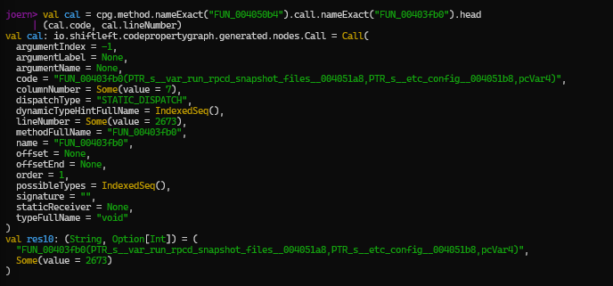

#### Xem nó dựng tham số như nào 

```
cal.cfgPrev.take(80).code.l
```

Kết quả:

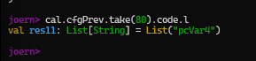

#### Phân tích

```C
for (uVar3 = 0; uVar3 < *param_2; uVar3 = uVar3 + 1) {
  pcVar4 = basename((char *)param_2[1] + uVar3 * 4);
  ...
}
```

Từ các kết quả trên ta có thể suy đoán rằng hàm FUN_004050b4 là một command xử lý danh sách các file hoặc các vector đối số từ argv/request

```C
snprintf(acStack_1014,0x1000, PTR_s__var_run_rpcd_uci__s__004051a0, puVar2);
mkdir(acStack_1014, 0x1c0);
```

Nó tạo folder dạng /var/run/rpcd/uci-%s. Nghĩa là chuẩn bị thư mục runtime để cho snapshot/restore

Quay ngược lại bên trên thì hàm FUN_00403fb4 nó gọi hàm FUN_00403fb0, hàm b0 là hàm copy. Thì có thể kết luận rằng cái hàm b4 là đang restore/copy file cấu hình từ snapshot runtime sang file /etc/config gì đó. Nghĩa là nếu kiểm soát được file snapshot thì sẽ khá nguy hiểm.

Ở bên trên có dùng cái hàm basename(), hàm này giúp loại bỏ path cố định để tránh traversal kiểu dấu gạch chéo mà chỉ giữ lại tên file cuối. Nhưng có đặc điểm là nó sẽ không tự động chặn các file dạng:
+ tên file bắt đầu bằng dấu .
+ tên file trùng file config nhạy cảm vd : network, firewall
+ ký tự lạ

Đây có thể là chủ ý, nhưng sẽ thành lỗ hổng nếu mà các file được viết bởi user thấp quyền, request cho phép user chọn file restore mà không xác thực hoặc dùng chung /var/run


### Giải mã đoạn FMT và mode của fopen

#### Xem đối số thứ 3 của cái hàm snprintf

```
cpg.call.nameExact("snprintf")
  .argument.order(3).code.l.distinct
```

Kết quả:

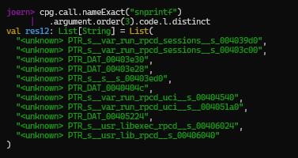

#### Tìm mọi hằng string dạng kiểu path

```
cpg.literal.code(".*%s.*").l.take(80).code
cpg.literal.code(".*rpcd.*").l.take(80).code
cpg.literal.code(".*var/.*").l.take(80).code
cpg.literal.code(".*tmp.*").l.take(80).code
```

Kết quả:

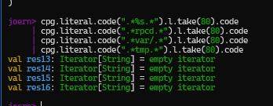

Có vẻ không thấy, ta đi tiếp

#### Tìm chỗ <global> có gán cái đối số đường dẫn kia

```
cpg.method.nameExact("<global>").ast.code(".*PTR_DAT_0040404c.*").l.take(50).code
cpg.method.nameExact("<global>").ast.code(".*0040404c.*").l.take(80).code
```

Kết quả:

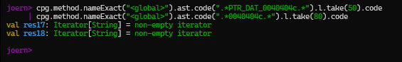

#### Lấy mode của fopen

```
cpg.call.nameExact("fopen")
  .argument.order(2).code.l.distinct
```

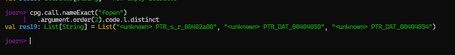

#### Xác định xem đối số có đến từ input source

Ta sẽ xem các đối số có đến từ các nguồn input như các request không

```
val inputs = List("read","recv","recvfrom","fgets","getenv","blobmsg_parse","json_tokener_parse")
cpg.method.nameExact("FUN_004050b4").call.nameExact(inputs*).l.map(c => (c.name, c.code, c.lineNumber))
```

Kết quả:

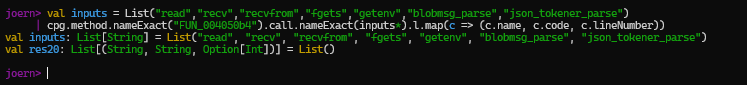

Không có 

#### Phân tích

Với việc khi truy vấn cfgPrev chỉ ra pcVar4 cho thấy là dữ liệu đang rất nghèo ở đoạn đó. Điều này có thể suy đoán pseudo C thiếu do ghidra export thiếu statement details.

Hiện tại ta cần biết một số thứ như đoạn format string FMT PTR_DAT_0040404c xem cuối đoạn path là dạng như nào (%s%s hay %s%s.conf hay %s-%s). Mode của  fopen vì đoạn truy vấn cho ta 1 loạt dạng unknown. Và cuối cùng là pcVar4 là basename của cái gì? argv hay blobmsg hay json.

## Truy vấn tiếp

### In trọn vẹn đoạn code b0 và b4 theo từng đoạn nhỏ

#### In dòng chứa snprintf và fopen trong b0

```
cpg.method.nameExact("FUN_00403fb0").ast
  .isCall
  .nameExact("snprintf","fopen")
  .l
  .map(c => (c.name, c.code, c.lineNumber))
```

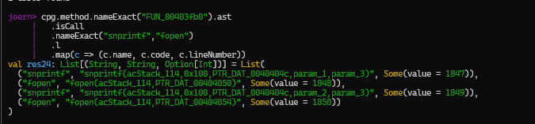

#### In các dòng chứa basename và gọi b0 trong b4

```
cpg.method.nameExact("FUN_004050b4").ast
  .isCall
  .nameExact("basename","FUN_00403fb0")
  .l
  .map(c => (c.name, c.code, c.lineNumber))
```

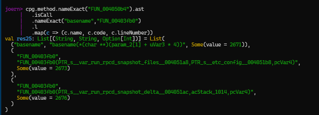

### Truy ngược pcVar4 

Vì pcVar4 được gán từ basename() ta sẽ tìm cái giá trị được gán đấy

```
cpg.method.nameExact("FUN_004050b4")
  .ast
  .code(".*pcVar4.*basename.*")
  .l
  .map(n => (n.code, n.lineNumber))
```

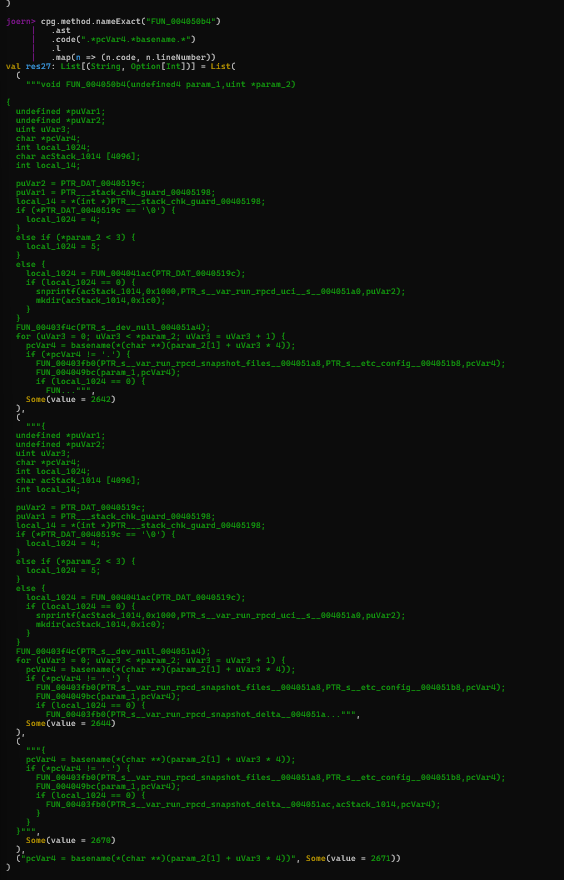

### Tìm hàm nào gọi b4

```
cpg.method.nameExact("FUN_004050b4").callIn.method
  .l
  .map(m => (m.name, m.fullName))
  .distinct
```

Kết quả:

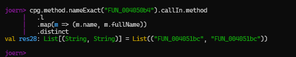

### Giải quyết cái PTR_DAT_... PTR_s___ thành hằng string

```
cpg.method.nameExact("<global>").ast.code(".*0040404c.*").l.take(200).map(_.code)
cpg.method.nameExact("<global>").ast.code(".*00404050.*|.*00404054.*").l.take(200).map(_.code)
```

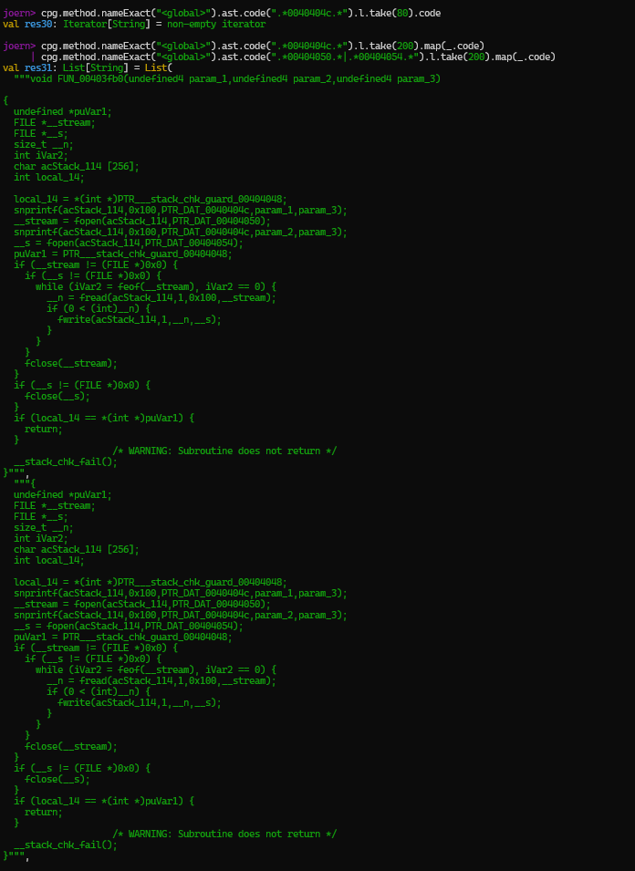

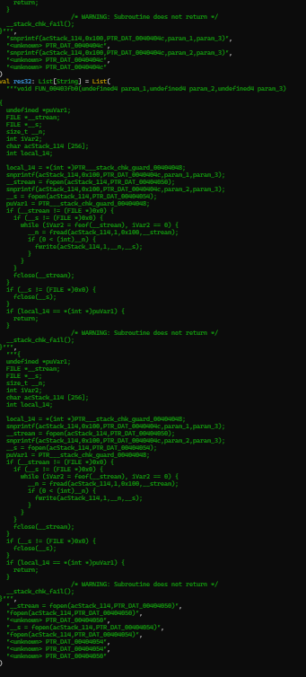

Kết quả ra tương đối dài

### Xem có mẫu đăng ký gì không

Xem có các mẫu cấu hình điều khiển gì không.

```
val regs = List("ubus_add_object","ubus_add_method","ubus_register","rpc_register","uloop_init")
cpg.call.nameExact(regs*).l.map(c => (c.method.name, c.name, c.code, c.lineNumber)).take(200)
```

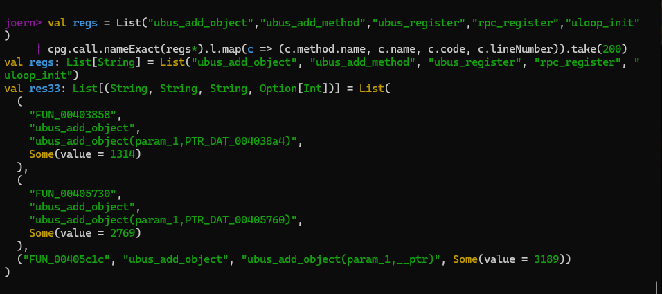

### Phân tích

Từ kết quả truy vấn trên ta có một số nhận định.

Với code của pcVar4:

```c
pcVar4 = basename(*(char **)(param_2[1] + uVar3 * 4));
```

basename cuar từng phần tử giống với argv hoặc list sstring. Basename cắt đường dẫn giảm traversal qua /

b4 Được gọi bởi cái hàm FUN_004051bc tạm gọi là 1bc, vì vậy lại phải truy lên hàm 1bc này, attack surface có thể nằm ở đây, có thể đây là 1 ubus handler(Hàm xử lý các request/command gửi đến 1 đối tượng Ubus)

Bên trên ta có query cái ubus_add_object thấy có 3 nơi gọi là FUN_00403858, FUN_00405730, FUN_00405c1c. Có thể restore handler trong các object này.

Với những dữ liệu trên ta có thể suy đoán sơ sơ là :
+ src = FMT("/var/run/rpcd/snapshot/files", pcVar4)
+ dst = FMT("/etc/config", pcVar4)

Khả năng dst là wb/w  thì có thể overwrite

Overwrite khả năng có thể là : etc/config/(network/firewall)

Từ đó là có thể disable firewall :)))

Ngoài ra ta chưa biết cái FMT(PTR_DAT_0040404c/50/54) kia là dạng như nào %s-%s hay gì, việc này có lẽ là không thể tiếp tục khai thác trong joern được vì ta đã truy vấn bên trên nhưng không ra gì. Vì vậy buộc phải vào ghidra để tới địa chỉ 0040404c để xem cái pointer tới string xem nó là gì.

Tương tự cũng phải vào ghidra để xem cái mode của PTR_DAT_0040404c/50/54 là gì, r/rb , w/wb

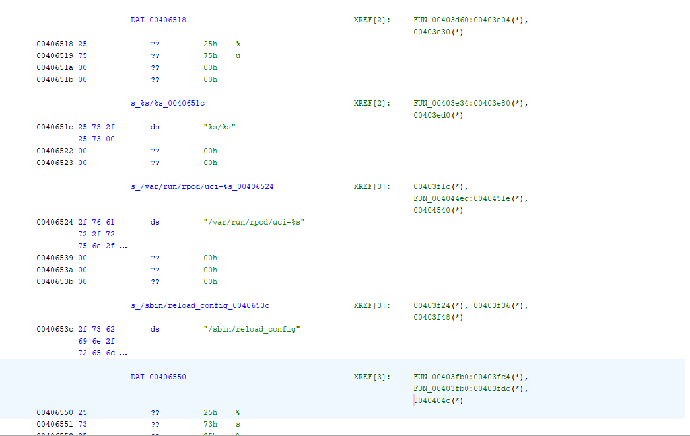

:)))

Dùng cái này từ đầu là ngon luôn :)))

Ở đoạn này sẽ có thắc mắc là có cách nào cải tiến để giúp joern truy vấn mà nhìn clear giống ghidra không. Thì câu trả lời có lẽ là không vì ghidra khi làm việc là nó sẽ quét toàn bộ memory và sẽ nhận diện ra string và tự define rồi lưu lại. Nghĩa là ghidra đang dựa vào chính binary. Còn với mô hình joern của ta hình tại đang dựa vào pseudo code. Em nghĩ nếu có khả năng kết hợp cả 2 hướng song song đồng thời gồm ghidra2cpg đọc binary thành đồ thị -> joern query và hướng ghidra tạo pseudo code -> c2cpg tạo đồ thị -> joern query thì chắc là sẽ ổn hơn nhưng rất phức tạp. Còn những string kia thì hoàn toàn là có thể lấy được bằng script từ ghidra xuất file csv nhưng không có cách nào nhét vào để joern hiểu được.

Giờ giả sử ta không dùng ghidra đi, ta tiếp tục truy vấn.

### Tiếp tục truy vấn với 1bc

#### Lấy code

```
println(cpg.method.nameExact("FUN_004051bc").head.code)
```

Mã giả :

```c
undefined4 FUN_004051bc(undefined4 param_1)

{
  undefined *puVar1;
  int iVar2;
  undefined4 uVar3;
  glob_t gStack_1038;
  char acStack_1014 [4096];
  int local_14;

  puVar1 = PTR___stack_chk_guard_0040521c;
  local_14 = *(int *)PTR___stack_chk_guard_0040521c;
  snprintf(acStack_1014,0x1000,PTR_DAT_00405224,PTR_s__var_run_rpcd_snapshot_files__00405220);
  iVar2 = glob(acStack_1014,0x80,(__errfunc *)0x0,&gStack_1038);
  if (iVar2 < 0) {
    uVar3 = 4;
  }
  else {
    FUN_004050b4(param_1,&gStack_1038);
    globfree(&gStack_1038);
    uVar3 = 0;
  }
  if (local_14 != *(int *)puVar1) {
                    /* WARNING: Subroutine does not return */
    __stack_chk_fail();
  }
  return uVar3;
}
```

Ở đây có thể hiểu rằng hàm này đang dùng snprintf để xây 1 path vào buffer 4096

Nó có dùng 1 hàm là glob() để tìm kiếm trên path đấy và nếu glob fail thì return 4. Nếu glob ok thì gọi đến cái hàm b4.

Mấu chốt là nó trả về gStack_1038.gl_pathv và cái này là mảng các path mà nó tìm được rồi nó truyền vào hàm b4 để xử lý từng file. 

#### Phân tích

Ở đoạn trên ta hiểu một chút về cái hàm 1bc. Dựa vào mã dã thì có thể thấy là cái buffer cũng được giới hạn 4096 và cả cái snprintf cũng với 0x1000 nên khả năng khó có overflow. Nhưng điểm đáng nghi ở đây là gglob() tìm nhưng không filter gì và basename() cũng chỉ kiểm tra _*pcVar4 != '.'_  nghĩa là bỏ file bắt đầu bằng dấu '.', nó không check symlink, path traversal. 

Điều này có một số thứ khả nghi:
+ Tấn công Symlink : attacker kiểm soát cái thư mục snapshot_files -> tạo symlink -> glob mà thấy symlink -> vượt qua basename -> hàm b0 copy file -> Có thể ghi đè file tùy ý
+ TOCTOU : khoảng thời gian mà kiểm tra và sử dụng mà bị khai thác thì nguy hiểm. Nghĩa là giữa khoảng thời gian tìm file có không và mở file để đọc ghi thì nếu file bị thay đổi hoặc thay thế bởi 1 file khác thì có thể chương trình thao tác chơi file không mong muốn

Ở đây có một số cách để phòng chống cái symlink kia là dùng lstat/fstat để kiểm tra file thật hay symlink. Hoặc là 0_EXCL, check (realpath). Hoặc ít thì cũng cần check chủ sở hữu hay quyền của cái snapshot trước khi xử lí

Chốt lại, ở đay có 1 số hướng đi:
+ Overwrite qua snapshot: Nếu attacker tạo được file symlink trong snapshot thì nguy hiểm
+ Đọc file tùy ý: ở hàm b0 có đoạn đọc file, nếu kiểm soát được tham số đường dẫn có thể lái tới file nhạy cảm
+ Path traversal: Cái kiểm tra của basename hơi sơ sài vì chỉ là pcVar4!='.' 
  
#### Tìm xem cái nào gọi 1bc

```
cpg.method.nameExact("FUN_004051bc").callIn.method.name.l.distinct
```

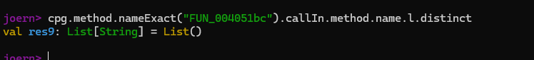

Không có gì.

#### Vị trí truyền tham số param_1

```
cpg.method.nameExact("FUN_004051bc").callIn
  .map(c => (c.method.name, c.code, c.lineNumber))
  .l
```

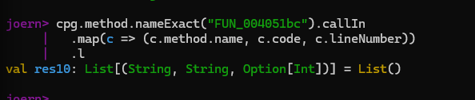

#### Tìm xem có cơ chế check symlink gì không

```
cpg.method.nameExact("FUN_00403fb0").call.name("lstat","fstat","realpath","open").code.l
```

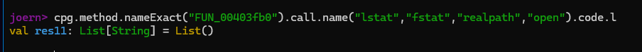

Không thấy gì, có vẻ có tia sáng

Tìm xem có cái mở file bằng fopen không :

```
cpg.method.nameExact("FUN_00403fb0").call.nameExact("fopen").code.l
```

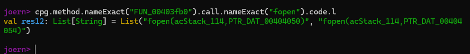

Có vẻ ok.

#### Phân tích

Ở đây cái khó là lại không thể thấy được hàm 1bc được gọi như nào. Có lẽ vì nguồn dữ liệu hơi nghèo hoặc nó cũng không nằm trong struct /init nào trong CPG nên không đi sâu được. Vì vậy không thể dùng thuần joern để truy vấn được.

Tuy nhiêm ta có 1 khe sáng là các hàm không kiểm tra symlink. Giờ ta cần tìm xem có hàm nào gọi snapshot không.

#### Tìm hàm gọi snapshot

```
cpg.call
  .code(".*snapshot.*")
  .map(c => (c.method.name, c.code, c.lineNumber))
  .l
```

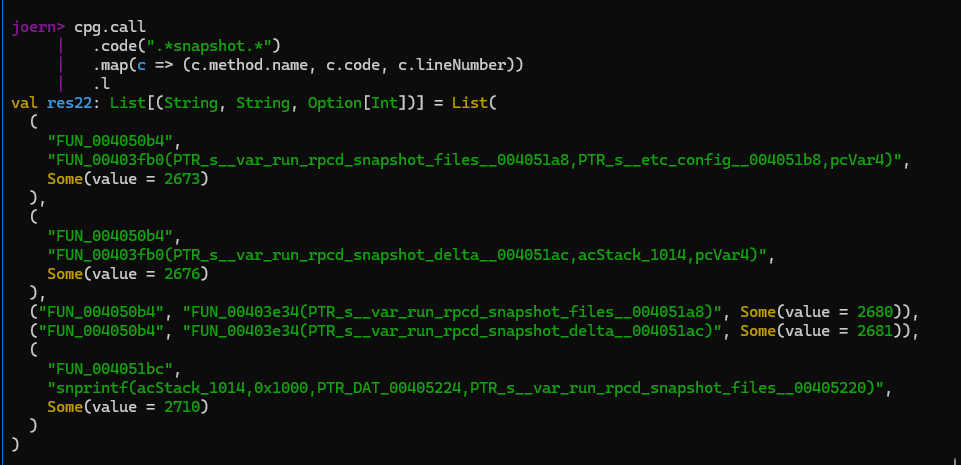

Từ kết quả trên có thể hiểu rằng hàm 1bc glob snapshot_files rồi gọi b4 để restore. Hàm b4 vừa copy vừa dọn thư mục luôn. Có vẻ tới đây là cụt đường rồi.
