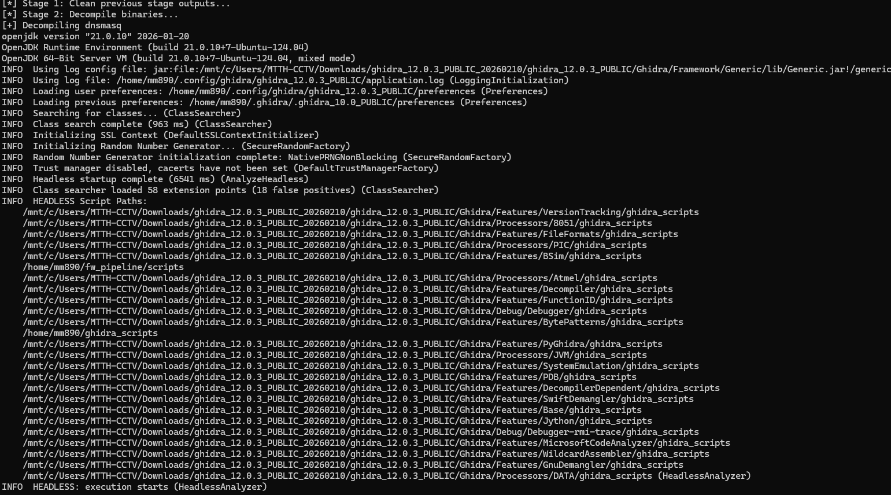
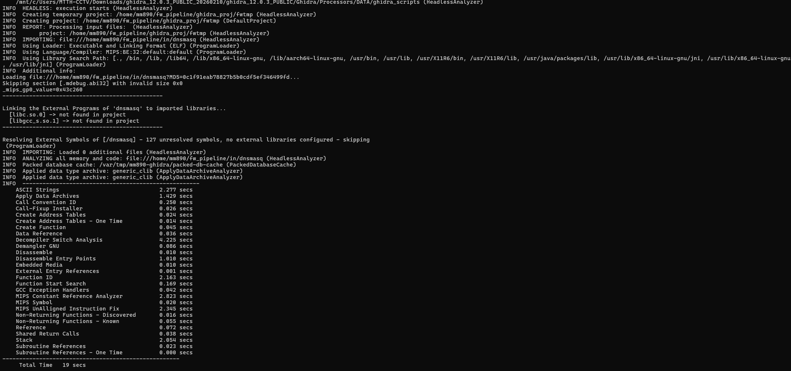

# 1. Tổng quan

Ở lần thử nghiệm này, sẽ sử dụng mô hình : EMBA -> Ghidra -> Code Chunking -> LLM Phân tích + CWE + OWASP mapping -> Report. Mọi quá trình sẽ để tự động từ đầu đến cuối bao gồm cả việc gửi dữ liệu giữa các thành phần và phân tích. Cuối cùng là xuất ra final report dạng md

```
Firmware input
   ↓
Upload lên server
   ↓
EMBA phân tích firmware
   ↓
Pull rootfs và log về máy local
   ↓
Ghidra decompile binary
   ↓
Chunk function
   ↓
LLM phân tích lỗ hổng
   ↓
Build final report
```


# 2. Quá trình chạy các thành phần

## 2.1 EMBA

EMBA trong mô hình này đóng vai trò dùng để nhận firmware binary đầu vào là file dạng bin,.... để thực hiện quá trình extraction firmware. Xác định kiến trúc và hệ điều hành. Ngoài ra cũng sẽ chạy quét qua 1 lượt về phân tích tổng quát các lỗ hổng có thể có trong file.

Kết quả của bước này là sẽ cho root filesystem của firmware và các binary execute trong firmware. Kết quả này bao gồm root filesystem và binary executable sẽ được gửi về cho Ghidra và kết quả của phân tích file cũng sẽ được sử dụng 1 cách hợp lí cho chọn lọc vào ghidra


Ở thành phần này sẽ để chạy ở trên Server riêng vì tốn CPU quá căng

Nhận xét: 
+ EMBA khá là mạnh và có vẻ chạy cũng xịn trong việc giải quyết quá trình extract và có những phân tích rất chi tiết và bao quát rất rộng, cho kết quả hàng loạt lỗ hổng và cũng khá chi tiết
+ Nhưng với trải nghiệm của bản thân thì setup cũng hơi khó vì nếu không có những cập nhật, sửa config hợp lí thì EMBA sẽ không chạy và mãi cũng không có báo lỗi cụ thể gì. Ví dụ như là nếu như cái Database mà nó không có cái dữ liệu của loại binary đó thì nó sẽ báo 1 lỗi nhỏ trong DB nhưng khi ta sử dụng cập nhật của bằng lệnh tùy chỉnh của chính EMBA thì nó không không cập nhật thêm gì mới nhưng đến khi dùng thì lại vẫn báo là thiếu DB. Do vậy chạy đi chạy lại mà mãi không được. Cách cuối cùng để sửa là đã phải vào file config để bỏ đi cái module chạy cái đó để không dính lỗi cập nhật. Thêm vào đó là cũng phải tự _wget_ những DB còn thiếu.
+ Tuy nhiên, bỏ qua các lỗi trong quy trình config thì ngoài ra EMBA có vẻ chạy khá lâu, rơi vào khoảng tầm 1 tiếng rưỡi -> 2 tiếng cho 1 file bin. Quá trình này tiêu tốn khá nhiều CPU và cả RAM. CPU gần như trong quá trình chạy của server thì luôn full 100% :<


## 2.2. Ghidra

Ghidra trong quá trình này được sử dụng để biến binary thành pseudo C. Từ các thông tin đã có từ EMBA, sẽ load file và tự lấy và đẩy ra pseudo C để phân tích. Như vậy sẽ dễ phân tích hơn.

```java
 cat DecompileAllToFile.java
import java.io.File;
import java.io.FileWriter;

import ghidra.app.decompiler.DecompInterface;
import ghidra.app.decompiler.DecompileResults;
import ghidra.app.script.GhidraScript;
import ghidra.program.model.listing.Function;
import ghidra.program.model.listing.FunctionIterator;
import ghidra.program.model.listing.FunctionManager;
import ghidra.util.task.ConsoleTaskMonitor;

public class DecompileAllToFile extends GhidraScript {

    @Override
    public void run() throws Exception {
        String[] args = getScriptArgs();
        if (args.length < 1) {
            println("Usage: DecompileAllToFile.java <output_dir>");
            return;
        }

        String outDir = args[0];
        File dir = new File(outDir);
        if (!dir.exists()) {
            dir.mkdirs();
        }

        DecompInterface ifc = new DecompInterface();
        if (!ifc.openProgram(currentProgram)) {
            println("[-] Failed to open program in decompiler");
            return;
        }

        FunctionManager fm = currentProgram.getFunctionManager();
        FunctionIterator funcs = fm.getFunctions(true);

        int ok = 0;
        int fail = 0;

        while (funcs.hasNext()) {
            Function f = funcs.next();

            try {
                DecompileResults res = ifc.decompileFunction(
                    f, 60, new ConsoleTaskMonitor()
                );

                if (!res.decompileCompleted() || res.getDecompiledFunction() == null) {
                    fail++;
                    continue;
                }

                String code = res.getDecompiledFunction().getC();
                String name = sanitizeName(f.getName());

                File out = new File(dir, name + ".c");
                FileWriter fw = new FileWriter(out);
                fw.write(code);
                fw.close();

                ok++;
            } catch (Exception e) {
                fail++;
            }
        }

        println("[+] Decompiled functions: " + ok);
        println("[+] Failed functions: " + fail);
    }

    private String sanitizeName(String s) {
        return s.replaceAll("[^a-zA-Z0-9_\\-\\.]", "_");
    }
}
```

Script trên sẽ lấy tất cả các function trong program đang mở trong ghidra. Dùng ghidra decompile API để decompile từng function. Lưu kết quả ra file .c, mỗi function là 1 file.






Nhận xét:
+ Quá trình này không có quá nhiều đánh giá. Việc phân tích khá nhanh, tổng thời gian quá trình rơi vào tầm 5p.

## 2.3. Chunking theo function

Module này tách các hàm thành các chunk, nghĩa là tách riêng các hàm ra các chunk để dễ phân tích vì nó phù hợp với việc đủ thành phần gồm input, xử lý và các sink. 

```py
#!/usr/bin/env python3
import json
import os
import re
import sys
from pathlib import Path

FUNC_RE = re.compile(
    r'^\s*[\w\*\s]+\s+[\w\*]+\s*\([^;]*\)\s*\{',
    re.MULTILINE
)

CONTROL_RE = re.compile(r'\b(if|while|for|switch)\b')

MAX_CHARS = 12000
SOFT_CHARS = 8000


def split_large_code(code: str):
    if len(code) <= MAX_CHARS:
        return [code]

    lines = code.splitlines(keepends=True)
    chunks = []
    cur = ""

    for line in lines:
        if len(cur) + len(line) > SOFT_CHARS and CONTROL_RE.search(line):
            chunks.append(cur)
            cur = line
        else:
            cur += line

    if cur.strip():
        chunks.append(cur)

    # fallback cứng nếu vẫn quá lớn
    final = []
    for c in chunks:
        if len(c) <= MAX_CHARS:
            final.append(c)
        else:
            for i in range(0, len(c), MAX_CHARS):
                final.append(c[i:i+MAX_CHARS])

    return final


def main():
    if len(sys.argv) != 3:
        print(f"Usage: {sys.argv[0]} <decomp_dir> <out_dir>")
        sys.exit(1)

    decomp_dir = Path(sys.argv[1])
    out_dir = Path(sys.argv[2])
    out_dir.mkdir(parents=True, exist_ok=True)

    files = sorted(decomp_dir.glob("*.c"))
    if not files:
        print(f"[-] No .c files in {decomp_dir}")
        sys.exit(0)

    binary_name = decomp_dir.name
    out_path = out_dir / f"{binary_name}.jsonl"

    total = 0
    with out_path.open("w", encoding="utf-8") as out:
        for f in files:
            code = f.read_text(encoding="utf-8", errors="ignore").strip()
            if not code:
                continue

            pieces = split_large_code(code)
            for idx, piece in enumerate(pieces):
                rec = {
                    "binary": binary_name,
                    "function_file": f.name,
                    "chunk_id": f"{f.stem}_{idx}",
                    "code": piece,
                }
                out.write(json.dumps(rec, ensure_ascii=False) + "\n")
                total += 1

    print(f"[+] Wrote {total} chunks -> {out_path}")


if __name__ == "__main__":
    main()
```

Nó sẽ đọc các file .c đã được decompile từ bước trước, mỗi file .c tương ứng với 1 hàm. Nếu hàm ngắn thì giữ nguyên, dài thì cắt thành nhiều đoạn nhỏ. Mục đích của chunk là để cắt thành nhiều thành phần để prompt đỡ nặng đỡ tốn token.

Nó sẽ tách bằng cách sử dụng regex để nhận diện các hàm vì các dấu {[]} thường khai báo đầu hàm hoặc dùng các regex các _if/while/for/switch_ để regex. Giới hạn độ dài 1 chunk là khoảng 8000-12000 ký tự

Kết quả sẽ là các file dạng jsonl chứa các chunk là các hàm.

Nhận xét:
+ Quá trình này cũng sẽ tương đối nhanh.
+ Có vẻ cho khá đầy đủ về các chunk của file.

## 2.4. LLM phân tích lỗ hổng

Trước tiên, sẽ gửi các chunk ở phần trước qua antigravity 

```py
#!/usr/bin/env python3
import glob
import json
import os
import re

BASE = os.path.expanduser("~/fw_pipeline")
RAW_DIR = os.path.join(BASE, "llm_raw")
PARSED_DIR = os.path.join(BASE, "llm_parsed")
os.makedirs(PARSED_DIR, exist_ok=True)


def extract_json(text: str):
    text = text.strip()

    # direct JSON
    try:
        return json.loads(text)
    except Exception:
        pass

    # fenced json
    m = re.search(r'```json\s*(\{.*?\})\s*```', text, re.S)
    if m:
        try:
            return json.loads(m.group(1))
        except Exception:
            pass

    # any object
    m = re.search(r'(\{.*\})', text, re.S)
    if m:
        try:
            return json.loads(m.group(1))
        except Exception:
            pass

    return {"summary": "Failed to parse model output", "findings": []}


for f in sorted(glob.glob(os.path.join(RAW_DIR, "*.raw.json"))):
    try:
        data = json.load(open(f, encoding="utf-8"))
    except Exception:
        continue

    content = ""
    try:
        content = data["choices"][0]["message"]["content"]
    except Exception:
        pass

    parsed = extract_json(content)
    parsed["_chunk"] = os.path.basename(f).replace(".raw.json", "")

    # infer binary from chunk filename prefix before first "__" or "."
    name = parsed["_chunk"]
    parsed["_binary"] = name.split("__")[0].split(".")[0]

    out = os.path.join(PARSED_DIR, os.path.basename(f).replace(".raw.json", ".parsed.json"))
    with open(out, "w", encoding="utf-8") as fp:
        json.dump(parsed, fp, indent=2, ensure_ascii=False)

    print(f"[+] parsed -> {out}")
❯ cat send_chunk.sh
#!/usr/bin/env bash
set -euo pipefail

if [ $# -lt 1 ]; then
  echo "Usage: $0 <chunk_json_file>"
  exit 1
fi

CHUNK_FILE="$1"

: "${LLM_BASE_URL:?LLM_BASE_URL is not set}"
: "${LLM_API_KEY:?LLM_API_KEY is not set}"
: "${LLM_MODEL:?LLM_MODEL is not set}"

RAW_DIR="${RAW_DIR:-$HOME/fw_pipeline/llm_raw}"
mkdir -p "$RAW_DIR"

base="$(basename "$CHUNK_FILE")"
out="$RAW_DIR/${base%.json}.raw.json"

PROMPT=$(cat <<'PROMPT_EOF'
You are a firmware security analyst.

Analyze the provided firmware pseudo-code chunk.
Look for:
- command injection
- buffer overflow
- path traversal
- auth bypass
- arbitrary file write
- unsafe deserialization
- dangerous use of system/popen/exec*
- attacker-controlled data reaching dangerous sinks

Return strict JSON with this schema:
{
  "summary": "...",
  "findings": [
    {
      "title": "...",
      "severity": "low|medium|high|critical",
      "confidence": 0.0,
      "reason": "...",
      "source": "...",
      "sink": "...",
      "evidence": "...",
      "cwe": "...",
      "istg_tags": ["..."]
    }
  ]
}
PROMPT_EOF
)

CHUNK_CONTENT="$(cat "$CHUNK_FILE")"

jq -n \
  --arg model "$LLM_MODEL" \
  --arg prompt "$PROMPT" \
  --arg chunk "$CHUNK_CONTENT" \
'{
  model: $model,
  messages: [
    {role: "system", content: $prompt},
    {role: "user", content: $chunk}
  ],
  temperature: 0.1
}' | curl -sS "$LLM_BASE_URL/chat/completions" \
  -H "Authorization: Bearer $LLM_API_KEY" \
  -H "Content-Type: application/json" \
  -d @- > "$out"

echo "[+] raw -> $out"
```

Cụ thể nó sẽ nhận vào 1 file chunk JSON, đọc nội dung chunk đó, ghép với prompt phân tích bảo mật firmware. Gửi request đến LLM API và lưu response của model vào thư mục llm_raw

Ở phần này, ta dùng prompt dựa trên phần gợi ý của bài viết. Prompt với LLM là chuyên gia phân tích firmware, sau đó dựa vào các lỗ hổng phổ biến kết hợp mapping với owasp iot security testing guide để nhận định và đánh giá các lỗ hổng.

```
You are a firmware security analyst.

Analyze the provided firmware pseudo-code chunk.
Look for:
- command injection
- buffer overflow
- path traversal
- auth bypass
- arbitrary file write
- unsafe deserialization
- dangerous use of system/popen/exec*
- attacker-controlled data reaching dangerous sinks

Return strict JSON with this schema:
{
  "summary": "...",
  "findings": [
    {
      "title": "...",
      "severity": "low|medium|high|critical",
      "confidence": 0.0,
      "reason": "...",
      "source": "...",
      "sink": "...",
      "evidence": "...",
      "cwe": "...",
      "istg_tags": ["..."]
    }
  ]
}
```

Module AI đang sử dụng là Antigravity Gemeni-flash-3 hoặc gemini-flash-2.5 để đỡ tốn.

Cuối cùng là sẽ đọc kết quả thô mà LLM trả về trong thư mục _llm\_raw_. Lấy phần json phân tích thật sự, thêm 1 vài thông tin của file đó.

```py
 cat parse_llm_raw.py
#!/usr/bin/env python3
import glob
import json
import os
import re

BASE = os.path.expanduser("~/fw_pipeline")
RAW_DIR = os.path.join(BASE, "llm_raw")
PARSED_DIR = os.path.join(BASE, "llm_parsed")
os.makedirs(PARSED_DIR, exist_ok=True)


def extract_json(text: str):
    text = text.strip()

    # direct JSON
    try:
        return json.loads(text)
    except Exception:
        pass

    # fenced json
    m = re.search(r'```json\s*(\{.*?\})\s*```', text, re.S)
    if m:
        try:
            return json.loads(m.group(1))
        except Exception:
            pass

    # any object
    m = re.search(r'(\{.*\})', text, re.S)
    if m:
        try:
            return json.loads(m.group(1))
        except Exception:
            pass

    return {"summary": "Failed to parse model output", "findings": []}


for f in sorted(glob.glob(os.path.join(RAW_DIR, "*.raw.json"))):
    try:
        data = json.load(open(f, encoding="utf-8"))
    except Exception:
        continue

    content = ""
    try:
        content = data["choices"][0]["message"]["content"]
    except Exception:
        pass

    parsed = extract_json(content)
    parsed["_chunk"] = os.path.basename(f).replace(".raw.json", "")

    # infer binary from chunk filename prefix before first "__" or "."
    name = parsed["_chunk"]
    parsed["_binary"] = name.split("__")[0].split(".")[0]

    out = os.path.join(PARSED_DIR, os.path.basename(f).replace(".raw.json", ".parsed.json"))
    with open(out, "w", encoding="utf-8") as fp:
        json.dump(parsed, fp, indent=2, ensure_ascii=False)

    print(f"[+] parsed -> {out}")
```