# Tổng quan

Đối với bài báo cơ bản pipeline như sau :

```
Firmware (.bin)
   │
   ▼
[1] Extract + Pre-Fuzzing
   ├─ binwalk extract filesystem
   ├─ tìm web binary (httpd / boa / lighttpd)
   ├─ phân tích tĩnh (IDA + LLM)
   │
   ├─ tìm:
   │   ├─ handler (URI/API)
   │   ├─ sink (system, strcpy,...)
   │   └─ khoảng cách tới sink
   │
   └─ Output:
       ├─ Pre_fuzzing.json
       ├─ sink_scope_addr.txt
       └─ distance_score.json

   │
   ▼
[2] Rehosting (Greenhouse)
   ├─ mount rootfs
   ├─ patch môi trường (nvram, config, lib thiếu)
   ├─ chạy QEMU user-mode
   └─ bật service web (httpd)

   │
   ▼
[3] Directed Fuzzing
   ├─ đọc Pre_fuzzing.json
   ├─ generate HTTP request:
   │     /cgi-bin/...?...=TAINTTAG
   ├─ mutate input
   └─ gửi vào service (curl / script)

   │
   ▼
[4] Runtime Monitoring (QEMU Instrumentation)
   ├─ theo dõi memory read từ input
   ├─ xác định:
   │     → Csource (input thật)
   │
   ├─ track:
   │     → indirect call (function pointer)
   │
   ├─ build:
   │     → call graph động
   │
   └─ log:
       ├─ qemu_taint.log
       └─ execution trace

   │
   ▼
[5] Xây dựng đường đi lỗi
   ├─ nối:
   │   Csource → call graph → sink
   ├─ lọc path khả thi
   └─ tạo potential vulnerability paths

   │
   ▼
[6] LLM Agent Layer
   ├─ (A) Taint Propagation Agent
   │     ├─ đọc code (IDA output)
   │     ├─ phân tích flow dữ liệu
   │     └─ xác định có vuln hay không
   │
   └─ (B) PoC Generation Agent
         ├─ lấy testcase từ fuzzing
         ├─ suy luận constraint
         └─ tạo payload exploit hoàn chỉnh

   │
   ▼
[7] Output
   ├─ Vulnerability (BOF, CI,...)
   ├─ PoC (request HTTP hoàn chỉnh)
   └─ log + báo cáo
```

Cơ bản thì phần quan trọng nhất, cốt lõi là phần rehosting, nó giúp thu thập thông tin cho quá trình sinh kết quả cuối.

Hiện tại thì em đã patch, hoàn thành được đầy đủ quá trình Prefuzzing đầu tiên, ngoài ra thay vì rehosting chuyên nghiệp trong 1 hệ thống Greenhouse để có thể theo dõi đường đi của fuzzing thì em có rehost bằng 1 tool mà tác giả gợi ý là FirmAE, tool này chỉ giúp chạy file firmware lên, nghĩa là đã chạy lên web

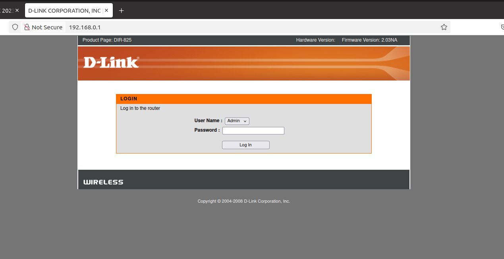

Và em cũng đã sử dụng script Fuzzing của tác giả để khai thác cái hệ thống kia nhưng chỉ đi sâu được vài tầng, nghĩa là thu thập được 1 số thông tin như là thấy 1 số những daemon là dạng file chạy chương trình hệ thống nguy hiểm. Tuy nhiên để đi sâu tiếp nữa thì không được, chẳng hạn như 1 2 đường tiếp cận đến đích là RCE chẳng hạn. Vì vậy cần sự hỗ trợ của 1 hệ thống cung cấp theo dõi quá trình fuzzing để xem cách đích bao nhiêu của GreenHouse để gửi thông tin cho LLM trong quá trình tiếp theo rồi sinh POC tiếp.

Do vậy, trong bài tác giả cũng đã gợi ý là có sẵn 1 docker file GreenHouse mà tác giả xây dựng để chạy firmware này. File GreenHouse-ae.tar

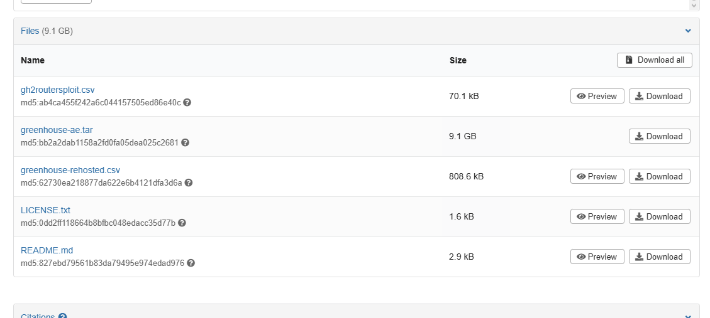

Theo như tác giả nói thì trong file này đã cung cấp môi trường đầy đủ cho việc rehosst firmware.

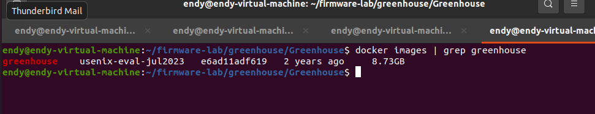

Phía trên là file docker mà tác giả đề cập

# Vấn đề gặp phải

Chạy docker kia lên và khởi tạo

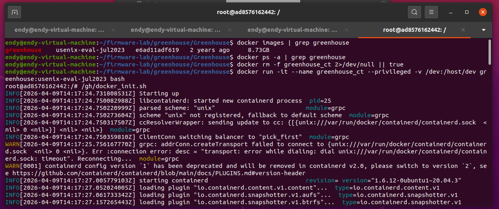

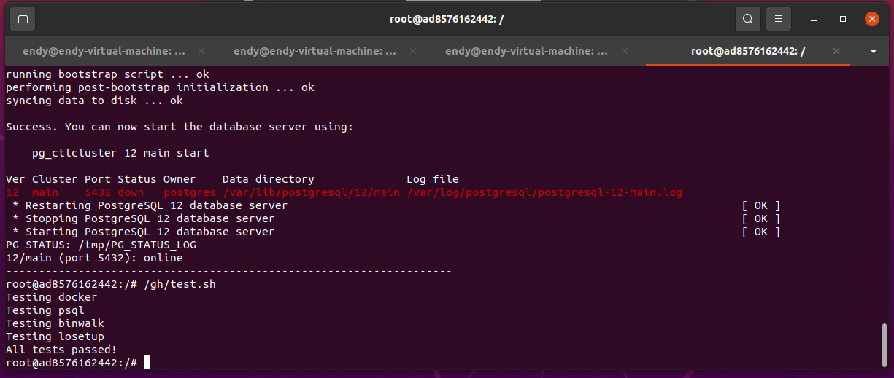

Tiến hành chạy file firmware lên :

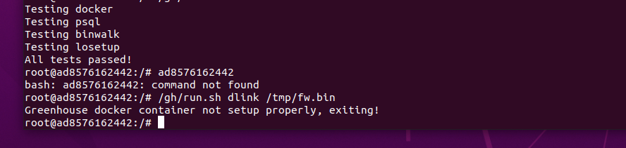

Như vậy có thể thấy là đã xuất hiện lỗi. Em tiến hành tìm lỗi, như trong ảnh thì nó bảo là không setup container đúng cách và tự hủy.

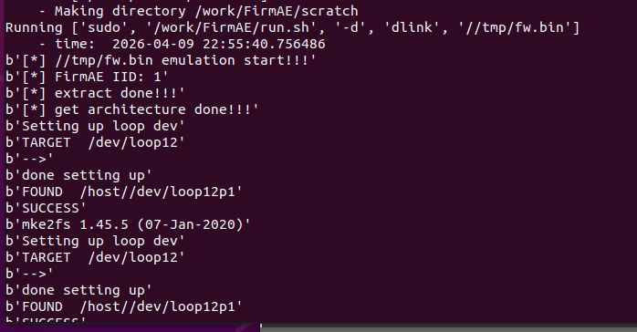

Về cơ bản, lỗi này có thể giải thích như sau. Sơ đồ cấu trúc chạy docker của hệ thống :

```
Máy host
└── Docker của host
    └── Container Greenhouse
        └── Docker daemon bên trong container
            └── Các container/image phụ phục vụ rehost
                └── Firmware/service được chạy và kiểm thử
```

Như vậy, có thể thấy là có 2 lớp docker chạy lồng nhau. Lớp docker bên ngoài dùng để chạy GreenHouse, lớp docker bên trong dùng để chạy các file cấu hình firmware phục vụ cho rehost

Mô hình trên đã chạy lỗi, nguyên do là mô hình này sẽ phải phụ thuộc nhiều lớp một lúc. Và với container của tác giả, đường dẫn của /dev/loop12 đã bị sai. loop12 dạng giống như 1 thư mục mà được code của tác giả chuyển thành dạng ổ đĩa cho firmware chạy.

Tiếp theo, trong log chạy có đoạn 

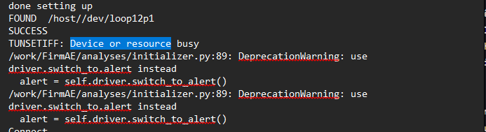

tiếp đó

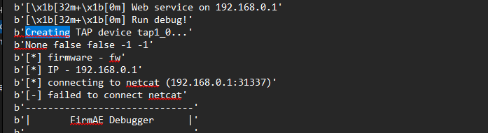

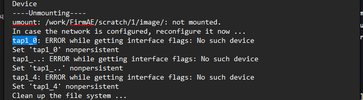

tap device có thể hiểu là như 1 card mạng ảo. Tuy nhiên qua quá trình chạy thì nó đã không thể tìm thấy card mạng. Có thể là do path lại không khớp hoặc là không có thật

Ngoài ra còn 1 số lỗi nữa như không kết nối netcat được hoặc không thấy file html web của firmware.

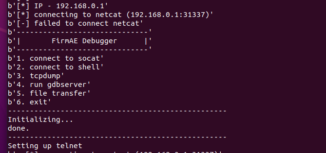


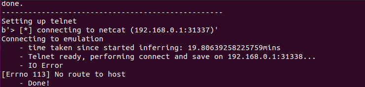

Sau đó em thử vá dần các lỗi trên. Cơ bản thì sẽ phải vá dần dần từng lớp dần vào trong vì cái thứ nhất chạy được thì dần dần các lớp phía sau mới chạy được.

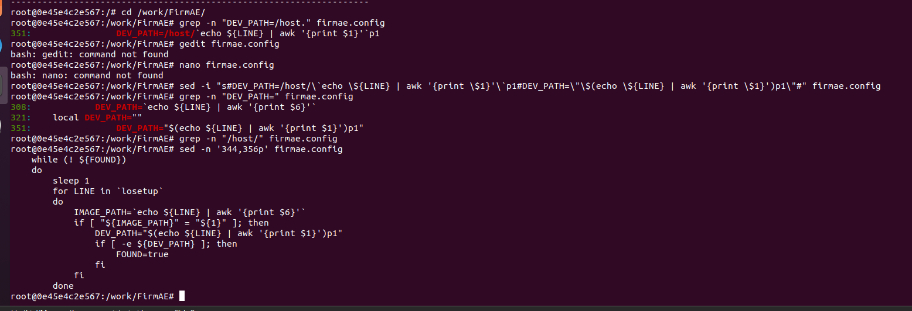

Vá xong cái đầu tiên thì chạy lại

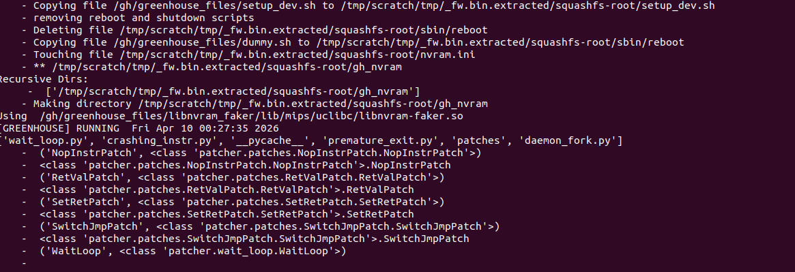

Sau khi chạy thì chờ 1 lúc rất lâu mà nó không ra log gì cả, tìm nguyên do thì có thể là do có vòng lặp vô hạn có thể path đúng nếu nó sai thì nó sleep 1s rồi cứ lặp lại mãi

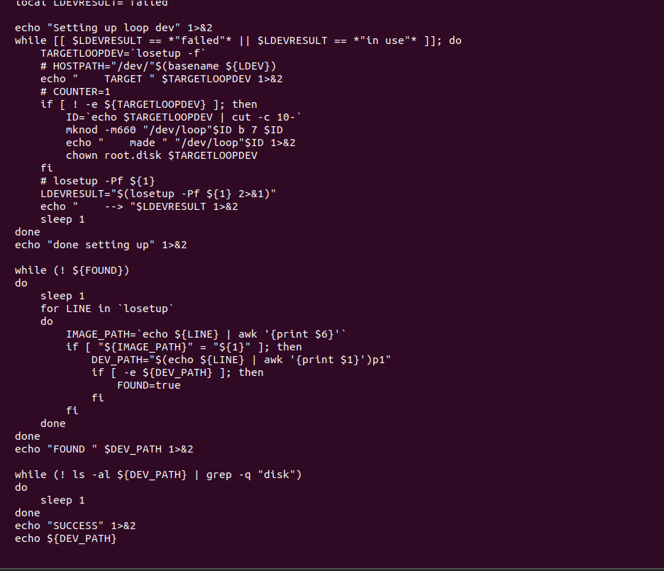

Sau khi vá bằng việc giới hạn vòng lặp, chạy lại thì web của firmware đã hoạt động. nhưng netcat vẫn chưa hoạt động, vá tiếp netcat

Sau lượt vá này thì thành tựu là /dev/loop12 đã tìm thấy

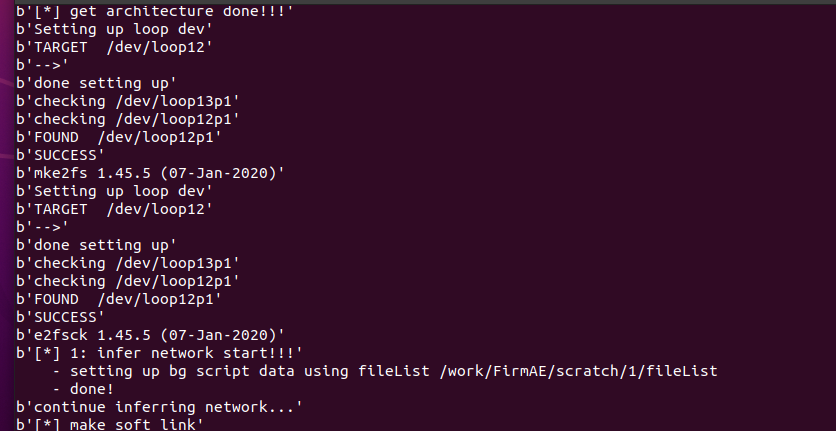

Tuy nhiên vẫn còn lỗi của cwd log và ps log. Cơ bản, lỗi là sau khi khởi động firmware lên, thì sẽ xuất hiện 2 file là ps.log và cwd.log.

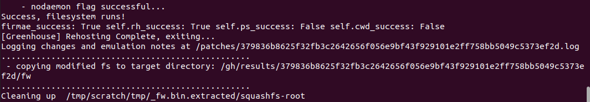

ps.log được sinh ra để giúp cho biết có process nào đang chạy. cwd.log cho biết từng process chạy trong thư mục nào

Đến giai đoạn này, em vẫn vá code như thường, vá 1 hàm get_cwd để nó tìm lại cái cwd.log ở chỗ cũ trước, nếu không thấy thì tìm thử thêm ở tmpfs/cwd.log, cả ps.log cũng tương tự

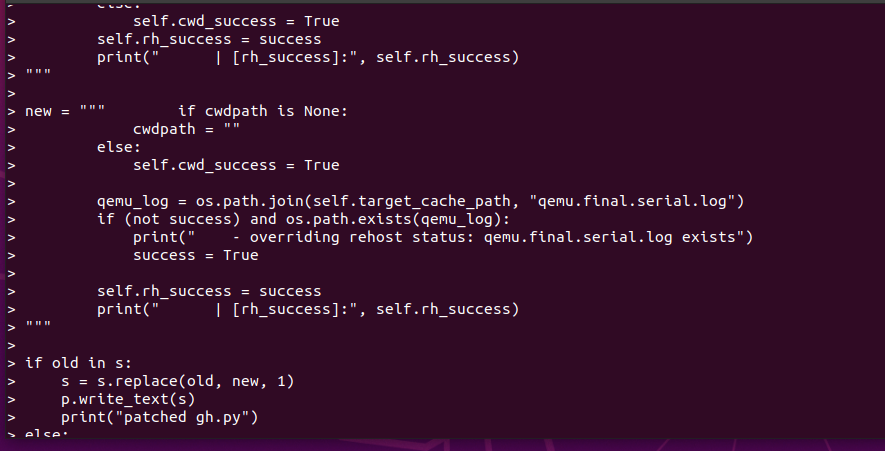

Tuy nhiên, sau khi chạy lại thì trong tmpfs vẫn không thấy được cwd.log và ps.log

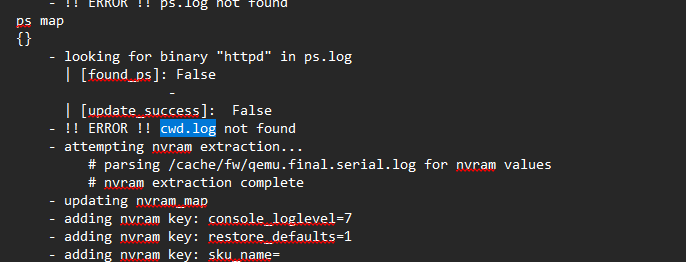

Sau khi patch mà vẫn bị lỗi, khả năng là đến tmpfs còn không có bởi vì trong log chạy không có dòng này. Và cả ở cũng chỉ có duy nhất log của qemu. ps.log và cwd.log vốn được tạo thông qua việc chạy firmware. Không tạo được thì cũng có thể do telnet không nối được vào firmware. Nhưng tại sao lại vậy thì cái này 
