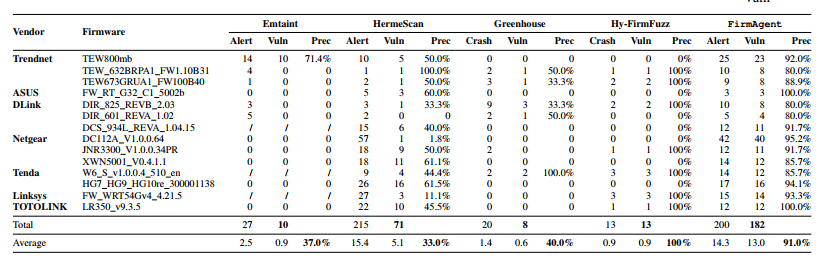

# Evaluation của bài báo

## Vuln

Theo em hiểu thì vuln ở đây là tác giả test lại PoC đã sinh ra từ LLM ở bước cuối cùng.

## Alert 

Số kết luận mà LLM đưa ra là có lỗ hổng

## Bảng đánh giá

Trong bài thì tác giả đã đưa ra bảng đánh giá và có so sánh với các hệ thống khác như Emtaint, HermeScan, Greenhouse. 



Precision sẽ được tính : Prec = Vuln/Alert

Như vậy trung bình là 91%

## Recall

Phần này không thấy tác giả nói là kiếm được bao nhiêu lỗ hổng trong các lỗ hổng thật sự.

## CVE

Tác giả có nói rằng từ 182 cái vuln được FirmAgent tìm ra thì có 140 cái là chưa được biết và công bố. Cuối cùng là được cấp 17 CVE. 

Tuy nhiên thì chi tiết chia từng CVE của firmware nào thì không thấy tác giả cung cấp

# Thực nghiệm

Ở phần này để cho phong phú thì em có cố thử mỗi hãng firmware mà tác giả cung cấp 1 cái, cụ thể là thử Dlink, Tenda, Trendnet, ASUS. Cụ thể là có 5 firmware

| Firmware | Our Alert/Candidate | Our Confirmed Vuln/PoC | Our Precision | Paper Firmware gần nhất | Paper FirmAgent Alert | Paper FirmAgent Vuln | Paper Precision | Ghi chú |
|---|---:|---:|---:|---|---:|---:|---:|---|
| DCS_934L_REVA_1.04.15 | 11 | 1 | 9.1% | DCS 934L REVA 1.04.15 | 12 | 11 | 91.7% | Fresh-per-PoC monitored rehost; crash confirmed ở `allocDecodePasswordByName` |
| DIR825_10B_httpd_20260415_003810 | 4 | 2 | 50.0% | DLink DIR 825 REVB 2.03 | 10 | 8 | 80.0% | 2 candidate bị loại, 2 PoC replay thành công; chỉ so gần đúng nếu khác version/hash |
| HG7_HG9_HG10re_300001138 | 16 | 16 | 100.0% | HG7 HG9 HG10re 300001138 | 17 | 16 | 94.1% | Kết quả gần paper nhất; cần kiểm tra 16 confirm có phải 16 vuln unique không |
| RT-G32_C1_5.0.0.2b | 2 | 2 | 100.0% | ASUS FW RT G32 C1 5002b | 3 | 3 | 100.0% | Replay đúng browser flow `start_apply.htm` |
| TEW673GRUA1_FW100B40 | 2 | 2 | 100.0% | TEW673GRUA1 FW100B40 | 9 | 8 | 88.9% | Mới replay được subset nhỏ; `sink-only negative` không tính là confirmed vuln |
| **Total** | **35** | **23** | **65.7%** | **5 firmware matched** | **51** | **46** | **90.2%** | Tổng chỉ tính trên các firmware trong bảng này, không phải toàn bộ 14 firmware của paper |

Có 1 số trường hợp như của DCS ra tỉ lệ rất xấu, gần như không làm được gì, nguyên do bởi vì rehost cái firmware đó lên rất yếu, chỉ cần bắn 1 gói tin GET rất đơn giản lên cũng đã làm sập rehost. Do vậy nên chỉ có thể làm được vậy.

# Vấn đề đang gặp phải của tác giả

## Phụ thuộc vào firmware rehosting

> Limitations of Firmware Rehosting : The capability of FirmAgent is fundamentally dependent on the underlying firmware rehosting framework. While
Greenhouse is one of the state-of-the-art solutions that support rehosting user-space components from firmware samples of mainstream router vendors, its success rate remains
low, especially when dealing with newer firmware versions.
Furthermore, Greenhouse is currently limited to emulating
a single service at a time. As a result, FirmAgent can
only detect vulnerabilities within that binary, potentially overlooking vulnerabilities that span across binaries or require
full-system emulation.

Có thể hiểu là nếu firmware không rehost được thì FirmAgent coi như không còn tác dụng, không làm được hẳn bước Dynamic

## Greenhouse rehost chưa ổn với firmware mới

>  its success rate remains
low, especially when dealing with newer firmware versions

Dataset của FirmAgent phải chọn firmware rehost được, firmware mới có thể nằm ngoài phạm vi.

## Chỉ mô phỏng được 1 service tại một thời điểm

> Greenhouse is currently limited to emulating
a single service at a time. As a result, FirmAgent can
only detect vulnerabilities within that binary, potentially overlooking vulnerabilities that span across binaries or require
full-system emulation. 

Nghĩa là hiện tại chỉ rehost được cái web của firmware như httpd chứ chưa thể mô phỏng như 1 con firmware thật với nhiều process

## Có thể bỏ sót lỗi multi-binary hoặc cần mô phỏng toàn bộ hệ thống

> potentially overlooking vulnerabilities that span across binaries or require full-system emulation

Có thể hiểu rằng nếu mà lỗi mà liên quan đến nhiều binary trong firmware hoặc nếu input mà cần đi từ httpd sang file/NVRAM rồi sang các binary khác thì FirmAgent không thể làm được

## False positive

> it is not entirely immune to inaccuracies. Our analysis reveals
that most false positives arise from buffer overflow detection.
Specifically, the LLM occasionally fails to account for the
actual size relationships between input data and target buffers.

Vấn đề false positive ở buffer overflow, LLM báo overflow nhưng thực tế input không vượt buffer hoặc LLM chưa hiểu chắc quan hệ kích thước input/buffer

## Một số PoC command injection có thể không thành công

> For instance, some firmware employs
blacklist-based input filtering mechanisms, which restrict the
use of special characters commonly used in command injection
(e.g., ’;’, ’|’, ’&’). However, these filtering mechanisms are
often incomplete or circumventable. Successfully triggering
them typically requires expert knowledge to understand the
execution context and craft an effective PoC accordingly.
Our findings demonstrate that this category of vulnerabilities
remains a challenge for fully automated triggering by current
LLM-based approaches.

Nghĩa là cơ bản là cái firmware có thể có cái cơ chế lọc ký tự, nên PoC sinh ra có thể có cái kí tự mà bị lọc thì PoC sẽ thất bại, vì vậy cần ngữ cảnh để thay đổi PoC. Và LLM hiện tại chưa đảm bảo sinh payload đúng cho mọi trường hợp.

# Đề xuất

## Multi rehosting

Nếu FirmAgent phục thuộc vào duy nhất 1 cái thì giờ ta đề xuất thêm 1 lớp điều phối thử các hệ thống rehost firmware khác nhau :

```
Firmware image
   ↓
Extract rootfs / detect arch / detect service
   ↓
Try Greenhouse single-service
   ↓ nếu fail
Try FirmAE/QEMU full-system
   ↓ nếu fail
Try QEMU user-mode/chroot
   ↓ nếu fail
Static-only analysis fallback
```

Thay vì phụ thuộc hoàn toàn vào Greenhouse, hệ thống nên có một tầng điều phối Rehosting để thử nhiều chiến lược rehost khác nhau. Nếu Greenhouse single-service thất bại, hệ thống có thể fallback sang FirmAE/QEMU full-system, QEMU user-mode hoặc static-only mode. Cách này giúp mở rộng tập firmware có thể phân tích và giảm phụ thuộc vào một framework rehosting duy nhất.

## Multi-service

Phần này sẽ giải quyết 2 việc : thứ nhất là khởi chạy nhiều dịch vụ. Thứ 2 là theo dõi các dịch vụ đó

Bài nói chỉ có thể mô phỏng được web firmware thì bây giờ mô phỏng cả firmware luôn. Phần này thì có 2 hướng:
+ 1 là sẽ mở rộng, dùng Greenhouse để khởi động cùng lúc nhiều dịch vụ thay vì chỉ httpd 
+ 2 là sẽ dùng hệ thống gồm FirmAE/Firmadyne/QEMU để boot hết firmware.

Hướng thứ nhất thì sát thiết bị thật. Nhưng mà nặng, tốn CPU/RAM, fuzzing chậm và theo dõi cũng sẽ khó hơn vì đa hệ thống.

Hướng thứ hai thì dễ tích hợp vì đang dùng và cũng dễ theo dõi nhưng mà sẽ phải tự setup môi trường như NVRAM, /dev/, /proc.

Thứ 2 là phần theo dõi thì sẽ theo dõi đa dịch vụ và theo dõi các phần chính như file, NVRAM, thực thi lệnh và bộ nhớ

## Bộ tổng hợp NVRAM

Vấn đề là nhiều cái path chỉ chạy fuzz khi mà config NVRAM có giá trị đúng. VD :

```c
if (nvram_match("enable_ap_mode", "1")) {
    system(...)
}
```

Fuzzer thường không biết phải set enable_ap_mode=1, nên không đi tiếp được

Ta sẽ đề xuất 1 module tổng hợp trạng thái cấu hình :

```
Static analysis tìm các key:
- enable_ap_mode
- enable_sta_mode
- deviceName
- wan_mode
- auth_enable

LLM/rule suy luận giá trị khả dĩ:
- "1"
- "0"
- "true"
- "admin"
- "pppoe"
- "dhcp"

Runtime inject vào nvram faker:
- nvram_get("enable_ap_mode") → "1"
```

Hệ thống :

```
IDA/strings scan
   ↓
Extract config keys
   ↓
Classify key type
   ↓
Generate candidate values
   ↓
Run fuzzing with state profile A/B/C
   ↓
Compare coverage / reached sinks
```

Ví dụ sẽ như này với 1 config :

```
{
  "profile_name": "ap_mode_enabled",
  "nvram": {
    "enable_ap_mode": "1",
    "enable_sta_mode": "0"
  }
}
```

## Giảm false positive buffer overflow

LLM không hiểu đúng quan hệ kích thước. Thì bây giờ cung cấp ra quyết định cho nó. Không nên để LLM quyết định buffer overflow 1 mình. Thêm 1 module ra quyết định :

```
LLM phát hiện nghi vấn overflow
   ↓
Buffer-size checker kiểm tra lại
   ↓
Nếu có bằng chứng input_size > buffer_size → giữ alert
Nếu không rõ → mark "needs manual review"
Nếu input chắc chắn bounded → loại false positive
```

Ví dụ output có thể như này :

```
{
  "alert": "buffer_overflow",
  "sink": "strcpy",
  "dst_buffer_size": 128,
  "max_input_size": 2048,
  "bounded": false,
  "verdict": "likely_true_positive",
  "reason": "input may exceed destination buffer"
}
```

```
Deterministic module kiểm tra lại:
  buf bao nhiêu byte?
  user_input tối đa bao nhiêu byte?
  có check strlen không?
  strcpy/snprintf dùng thế nào?
```


Không để LLM ra quyết định cuối. Sẽ code thuần để truy xuất lại code xem có BOF không

## PoC

PoC của command injection đang gặp vấn đề vì LLM sinh ra nhưng có thể bị filter. Lúc này phải phụ thuộc ngữ cảnh để sửa PoC lại. Thì bây giờ thay vì sinh 1 lần PoC thì ta sẽ loop. 

```
Generate PoC
   ↓
Run trong rehosted firmware
   ↓
Quan sát kết quả:
   - HTTP response
   - log
   - system/popen hook
   - crash
   - command executed marker
   ↓
Nếu fail:
   - lấy lý do fail
   - repair payload
   - chạy lại
```

## Kiến trúc đề xuất

```
                 ┌──────────────────────┐
                 │      Firmware         │
                 └──────────┬───────────┘
                            ↓
                 ┌──────────────────────┐
                 │ Rehosting Orchestrator│
                 │ Greenhouse/FirmAE/QEMU│
                 └──────────┬───────────┘
                            ↓
        ┌───────────────────┴───────────────────┐
        ↓                                       ↓
┌──────────────────┐                  ┌──────────────────┐
│ State Synthesizer│                  │ Multi-binary Map │
│ NVRAM/config     │                  │ file/ipc/nvram   │
└────────┬─────────┘                  └────────┬─────────┘
         ↓                                     ↓
┌──────────────────────────────────────────────────────────┐
│ Directed Fuzzing + Runtime Taint + Indirect Call Tracking │
└──────────────────────────┬───────────────────────────────┘
                           ↓
┌──────────────────────────────────────────────────────────┐
│ Normalized Trace: taint_events.jsonl / call_edges.jsonl   │
└──────────────────────────┬───────────────────────────────┘
                           ↓
┌──────────────────────────────────────────────────────────┐
│ LLM Taint Agent + Buffer-size Checker + Sanitizer Checker │
└──────────────────────────┬───────────────────────────────┘
                           ↓
┌──────────────────────────────────────────────────────────┐
│ PoC Agent: generate → run → observe → repair              │
└──────────────────────────┬───────────────────────────────┘
                           ↓
                  Confirmed Vulnerabilities

```

