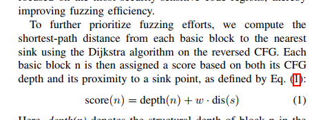
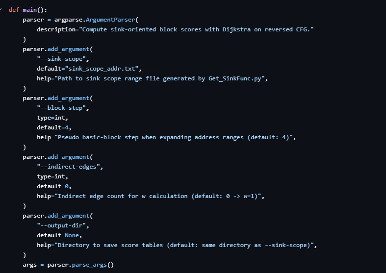
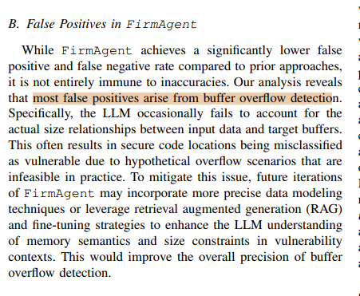
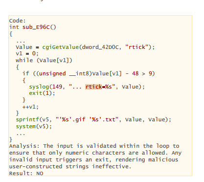
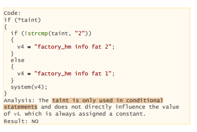
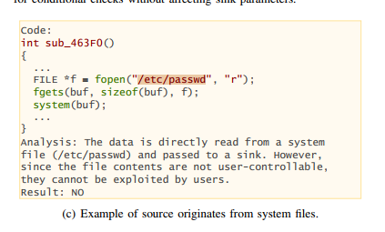

# Tổng quan

Phần trước đã đưa ra 5 đề xuất về cải tiến pipeline firmware, thích hợp nhất là sẽ sử dụng 2 đề xuất cải tiến ở phần ra quyết định cuối của pipeline là BoF checker và Loop PoC. Đây là 2 cải tiến phù hợp nhất vì nó ảnh hưởng trực tiếp đến kết quả cuối cùng nhưng lại không làm ảnh hưởng quá nhiều đến pipeline, không làm thay đổi quá nhiều pipeline của tác giả cũng như cấu trúc hệ thống như multi service/rehost. 

Ngoài ra, cần có 1 cải tiến khác đó là các kết quả của model LLM, do là các model có độ thông minh khác nhau nên có thể có kết quả tốt khác nhau. Về pipeline của tác giả thì dùng deepseek R1 và không có đánh giá thêm về các model khác nên đây có thể là điểm cần chú ý. Nếu cải tiến thì có thể chọn model ngon hoặc là multi-model để cho ra quyết định đúng đắn.

Một phần nữa là trong pipeline có phần tính distance.py là nhằm mục đích tính xem đường nào ổn nhất để ưu tiên cho quá trình fuzzing, trong đó có công thức tính điểm cần đặc biệt chú ý.

Phần cuối cùng là còn 1 đề xuất cải tiến bộ tổng hợp NVRAM, cần cân nhắc xem có phù hợp không vì có thể trùng ý tưởng

Như vậy là có 3 việc cần làm :
+ Thử nghiệm các model đơn với GPT, Deepseek, Gemini, Claude. Xem cái nào ra kết quả ổn. Và cân nhắc multi-model
+ Xem xét distance.py, Ablation w trên DIR_825 với w = 1, 2, 5, 10 đo coverage và số Csource reach được
+ Breakdown FP theo 4 nhóm

# Thực hiện


## Thử nghiệm các model

Ở phần này, em tiến hành thử nghiệm các model ở phần cuối của pipeline, nghĩa là sẽ dùng các prompt của sau quá trình Fuzzing+Taint để hỏi LLM xem cái nào có thể là lỗ hổng. Nghĩa là quá trình phán đoán Alert. Ở đây sử dụng 26 prompt của DIR 825 của phần kết quả phía trước. Và đối chiếu để đánh giá sẽ là kết quả của tác giả. Cụ thể của tác giả đưa ra là có 8 Vuln và 10 Alert.

Sau quá trình thực hiện, cụ thể có bảng sau :

| Model | Prompt runs | Prompts có tuple vuln | Tổng tuple vuln | Tỷ lệ alert so với paper (10) | Tỷ lệ vuln so với paper (8) |
|---|---:|---:|---:|---:|---:|
| `ag/gpt-oss-120b-medium` | 26 | 3 | 8 | 80.0% | 100.0% |
| `ag/gemini-3-flash` | 26 | 5 | 6 | 60.0% | 75.0% |
| `ag/claude-sonnet-4-6` | 26 | 5 | 5 | 50.0% | 62.5% |
| `DeepSeek-V3` | 26 | 3 | 6 | 60.0% | 75.0% |

Như vậy là có thể thấy GPT > DeepSeek-V3 = Gemini > Claude

Còn 1 phần nữa mà em đánh giá bọn nó là em sẽ đánh giá những cái tuple nó gửi cho với những cái mà em đã Validate bằng việc gửi PoC vào rehost ở phần của lần làm trước đó về việc chạy pipeline. Thì nhận thấy kết quả của GPT là ổn nhất vì nó tuy cho ít tuple vuln nhưng những tuple nó cho thì không thừa nhiều nghĩa là validate lại thì ok hết. Deepseek thì thừa 1 tuple. Còn lại Claude và Gemini đều thừa 2 tuple.

Của Deepseek thì phần này em có thực hiện prompt trong 1 phiên nên khả năng có sự hỗ trợ của memories nên ra quyết định ổn cũng có thể dễ hiểu. Do vậy sẽ rút kinh nghiệm phải thực hiện trong các session khác nhau.

## Distance.py

### Xem xét file distance.py

Công thức của nó là score = depth + w*distance_to_sink. Có thể hiểu là nó đang nhằm cân bằng cái depth và cái distance kia, mục đích là sẽ không ưu tiên fuzzing lệch hẳn về khoảng cách đến đích mà cái nào có điểm cao hơn thì ưu tiên, nghĩa là kể cả node A xa đích hơn node B nhưng điểm của A cao hơn B thì vẫn ưu tiên Fuzz A trước bởi vì A được w ưu tiên cân bằng, nó giống kiểu A có nhiều thứ cần đáng khám phá hơn nên ưu tiên A hơn. Còn nếu điểm B cao hơn thì vẫn để B Fuzz trước như thường. 

Điều đáng nói ở đây là công thức tính cân bằng w của tác giả đang fix cứng là :

```py
def calculate_weight(total_edges_in_cfg, total_indirect_edges):
    if total_indirect_edges:
        weight = round(total_edges_in_cfg / total_indirect_edges, 3)
    else:
        weight = 1
    return min(weight, 10)
```

Mã giả có thể như này :

```
Nếu total_indirect_edges > 0:

    w = min(round(E / I, 3), 10)

Nếu total_indirect_edges = 0:

    w = 1
```

Nghĩa là nếu có cạnh thì sẽ tính bằng min((tổng số cạnh)/(tổng số cạnh indirect) , 10)

Cái cạnh indirect kia thì là tự tay truyền vào, không phải là do dựng đồ thị gì cả.

Tuy nhiên, trong code distance.py thì tác giả lại không có code lấy số lượng cạnh indirect và những cạnh này cũng chỉ có thể lấy ở sau quá trình fuzz, do vậy mặc định nếu không truyền số lượng cạnh indirect thì hệ số cân bằng w mặc định là 1 rồi. Như vậy là đúng như lời tác giả nói là có lẽ tác giả vẫn đang để ưu tiên khoảng cách đến đích gần hơn 



Code của tác giả :



Do vậy là có lẽ cải tiến phần này chắc là không thể

### Ablation w = 1,2,5,10

Ở phần này, cần ablation w trên DIR_825 với w = 1, 2, 5, 10 đo coverage và số Csource reach được

Theo như kết quả của phần trước đó của DIR 825 thì sẽ cho ra 200 source để cho bước tính distance.py này với các giá trị cho 1,2,5,10

Tuy nhiên vì giới hạn của dung lượng, máy em chỉ còn rơi vào 80Gb cho toàn bộ quá trình này bao gồm tính lần lượt các distance với các giá trị 1,2,5,10 và sau đó fuzz với từng kết quả của distance của các giá trị trên nên là chắc chắn không đủ dung lượng để chạy được. Cụ thể là em chạy với 30 source cho fuzz loại w = 1 đã hết dung lượng, nghĩa là còn không cả kịp chạy fuzz với loại w=2,5,10. Sau đó em chạy lại, fuzz với lượng là 20 source thì có kết quả như sau:

| `w` | Coverage | `Csource reach` | Trace log size |
|---|---:|---:|---:|
| 1 | 1495 | 6 | 8,696,005,974 |
| 2 | 1393 | 6 | 8,766,152,202 |
| 5 | 1386 | 6 | 8,718,585,856 |
| 10 | 1384 | 6 | 3,305,158,342 |

Em cũng thấy lạ vì sao CSource reach đều ra 6 nên là em cố chạy lại với số lượng source là 11 thì ra kết quả:

| `w` | Coverage | Csource reach | Trace log size |
|---|---:|---:|---:|
| 1 | 1392 | 6 | 5,015,963,680 |
| 2 | 1391 | 6 | 5,074,614,794 |
| 5 | 1393 | 6 | 5,103,774,522 |
| 10 | 1387 | 6 | 5,002,522,510 |

Đến đây thì nó vẫn ra 6 thì em tìm nguyên nhân. Theo em được biết thì nó vẫn fuzz trên những cái source đó nên không đổi. Cụ thể giả sử có source tập : a,b,c,d,e,f,... Nếu:

w = 1 -> Thứ tự : a,b,c,d,e,f

w = 10 -> Thứ tự : a,b,c,e,d,f

Như vậy là nó vẫn chạm được 6 cái thằng như nhau. Nhưng đấy là trên lí tưởng thôi. Lý do theo em hiểu thì do ở 11 source với 20 source thì cái sau khi sắp xếp theo thứ tự điểm của w=1,2,5,10 thì ứng với mỗi trường hợp w thì những cái source kia nó vẫn nằm ở đầu. Đây là trường hợp hy hữu, nghĩa là những cái source kia nó quá mạnh dẫn đến nằm gần nhau và ở top đầu nên kết quả là gần như luôn gặp 6 cái source kia -> kết quả là không đổi giữa các w.

Tuy nhiên, mặc dù không thể chạy được 200source, em đã cố đào sâu trao đổi với AI thì được biết được rằng với 200 source thì được biết là chưa chắc kết quả ra Csource reach của các w đã như nhau. Nguyên do bởi vì giả sử ta có tập thứ tự khác nhau. Thằng đi trước sẽ gây ảnh hưởng đến cái môi trường của rehost, nghĩa là có thể thay đổi trạng thái của những cái thành phần trong môi trường dẫn đến thằng sau bị ảnh hưởng, lúc này thứ tự sẽ quyết định rất quan trọng đến việc ra kết quả khác nhau. Ví dụ như A đi đấm boxing, A đấm vỡ bao cát khiến cho B là người đến sau không có thể làm gì. Do vậy nên lúc này với mỗi w khác nhau thì thứ tự khác nhau sẽ cho ra kết quả khác nhau. Lí do trên để giải thích tại sao kết quả khác nhau, còn lí do tại sao 200 source thì lại kết quả khác đi so với 11 hay 20 thì lúc này chạy trên 200 source thì cái không gian nó lớn hơn dẫn đến kết quả sẽ khác so với 11 và 20.

## Breakdown FP theo 4 nhóm

### 1. Buffer size

LLM báo BOF nhưng kiểm tra kĩ thì input không thể vượt qua buffer đích.



VD :

```c++
char buf[128];
char name[64];

websGetVar(req, "name", name, 64);
strcpy(buf, name);
```

LLM thấy strcpy thì phán luôn overflow nhưng thực tế là đã có name tối đa 64 byte, buf 128 byte

Nếu có bằng chứng: input_max_size <= dst_buffer_size hoặc copy_bound <= dst_buffer_size -> TH1

### 2. Kiểm tra chiều dài, lọc thiếu

Input đúng là do người dùng nhập có tới gần sink nhưng trước khi vào sink thì đã bị kiểm tra độ dài, lọc kí tự nguy hiểm, ép định dạng, truncate nên có thể LLM bỏ qua đoạn được bảo vệ trên nên báo nhầm.

Trong bài báo có ví dụ input rtick được validate trong vòng lặp để chỉ cho phép kí tự số nếu không có kí tự số thì exit(1) nên input độc hại không có tác dụng



Nếu PoC fail vì input đã bị check/filter hợp lệ trước sink -> TH2

### 3. Taint không lan truyền/Taint hỏng

LLM có thể tưởng dữ liệu nhập từ người dùng đi tới sink nhưng thực tế dữ liệu đó không ảnh hưởng trực tiếp tới tham số sink.

Trong bài có ví dụ biến taint chỉ được dùng trong điều kiện if/strcmp, còn biến đưa vào sink system() là 1 chuỗi cố định nên cái mà input đưa vào không có liên quan hay ảnh hưởng gì đến sink cả



VD đơn giản :

```c++
char *x = get_param("mode");

if (!strcmp(x, "2")) {
    cmd = "factory_hm info fat 2";
} else {
    cmd = "factory_hm info fat 1";
}

system(cmd);
```

Có thể thấy là x có ảnh hưởng đến cái nhánh điều kiện nhưng không trực tiếp ghép vào lệnh system và cái command trong system luôn cố định là 2 giá trị : factory_hm info fat 2, factory_hm info fat 1

Nếu đường taint bị đứt trước sink -> TH3

### 4. Nguồn không hợp lệ/ nguồn tệp hệ thống/ đường dẫn không khả thi

LLM báo lỗi vì thấy dữ liệu tới sink nhưng nguồn dữ liệu thì lại không phải do user hay attacker điều khiển, hoặc là cái đường dẫn này không khả thi trong thực tế

Trong bài có ví dụ dữ liệu được đọc từ /etc/passwd rồi đưa vào system(), nhưng đó là file hệ thống, không phải cái mà user có quyền điều khiển nên không khai thác được theo kiểu user input



VD:

```c
FILE *f = fopen("/etc/passwd", "r");
fgets(buf, sizeof(buf), f);
system(buf);
```

Ở đây dữ liệu có đi vào system nhưng attacker không có điều khiển /etc/passwd nên không tính là lỗi

Nếu source không phải external input hợp lệ hoặc path không thể reach trong điều kiện hợp lệ -> TH4